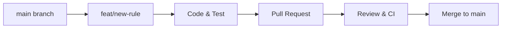

# Contributing to ThreatScope

Thank you for your interest in contributing to **ThreatScope — Advanced Email Header Analysis & Incident Response Platform**! We welcome contributions from cybersecurity researchers, software engineers, security analysts, and open-source enthusiasts.

This guide outlines our development workflow, coding standards, contribution guidelines, and code of conduct to ensure a smooth collaboration.

---

## Contribution Guidelines
1. **Quality & Precision:** All contributions must uphold rigorous security, mathematical scoring accuracy, and code readability standards.
2. **Stateless Privacy Principle:** ThreatScope is strictly a **zero-retention, in-memory** platform. No feature that introduces persistent server-side storage of email content or user data will be accepted.
3. **Deterministic Heuristics:** Detection rules must be explainable and deterministic. Avoid black-box uncalibrated heuristics that produce high false-positive rates.

---

## Code of Conduct
We are committed to providing a welcoming, inclusive, and harassment-free environment for all contributors.

### Our Standards
* **Respectful Collaboration:** Treat all community members with empathy and professional respect.
* **Constructive Feedback:** Provide and accept constructive technical feedback gracefully.
* **Ethical Security Practice:** Focus strictly on defensive security research, threat detection, and forensic analysis.

---

## Project Overview
ThreatScope is an asynchronous FastAPI web application combined with a modern vanilla JavaScript/CSS single-page application. It parses raw email headers, `.eml` files, and Outlook `.msg` files, executing a 19-rule heuristic detection engine across 4 security checkpoints and rendering visual forensic reports with LeafletJS.

---

## Prerequisites
* **Python:** Python 3.8 or higher (Python 3.10+ recommended).
* **Git:** Version control client.
* **Modern Web Browser:** Google Chrome, Firefox, Edge, or Safari.
* **Package Manager:** `pip` (Python package manager).

---

## Development Environment
We recommend developing on VS Code, PyCharm, or Antigravity IDE with the following extensions:
* Python Extension (Pylance, Flake8, Black)
* HTML/CSS/JS Formatter

---

## Repository Setup
Fork the repository on GitHub and clone your fork locally:
```bash
git clone https://github.com/<your-username>/Threat-Scope-Email-Header-Analysis.git
cd Threat-Scope-Email-Header-Analysis
git remote add upstream https://github.com/YonithJamad/Threat-Scope-Email-Header-Analysis.git
```

---

## Installation

### 1. Create a Virtual Environment
* **Windows (PowerShell):**
  ```powershell
  python -m venv venv
  .\venv\Scripts\Activate.ps1
  ```
* **Linux / macOS:**
  ```bash
  python3 -m venv venv
  source venv/bin/activate
  ```

### 2. Install Development Dependencies
```bash
pip install --upgrade pip
pip install -r requirements.txt
pip install pytest pytest-asyncio flake8 black bandit
```

---

## Configuration
No mandatory configuration files are required. Optional VirusTotal API keys can be entered directly in the web UI under **Settings**.

---

## Environment Variables
The application recognizes the following optional environment variables:
* `HOST`: Server bind address (Default: `127.0.0.1`).
* `PORT`: Server port number (Default: `8000`).

---

## Project Structure

```
Email-Header-Analysis/
├── docs/                               # Technical Documentation Suite
│   ├── PRD.md                          # Product Requirements Document
│   ├── SRS.md                          # Software Requirements Specification (30 Sections)
│   ├── Architecture.md                 # Architecture Document (C4 Model)
│   ├── UI-UX.md                        # UI/UX Specification & Design Tokens
│   ├── Development.md                  # Developer Guide & Runbook
│   └── Testing.md                      # QA & Test Suite Specification
├── main.py                             # FastAPI backend & 19-rule heuristic engine
├── index.html                          # Single-page application UI structure
├── style.css                           # Cyber-defense design system & theme engine
├── script.js                           # Frontend controller, Leaflet map, DOM rendering
├── requirements.txt                    # Python library dependencies
├── README.md                           # Master repository documentation (35+ sections)
├── CHANGELOG.md                        # Semantic versioning release changelog
├── CONTRIBUTING.md                     # Contributor guidelines (This file)
├── threatscope_logo.png                # ThreatScope brand logo
└── venv/                               # Python isolated virtual environment (git-ignored)
```

---

## Development Workflow

### Starting the Local Server
```bash
python -m uvicorn main:app --host 127.0.0.1 --port 8000 --reload
```
Changes to `main.py`, `script.js`, `style.css`, or `index.html` will automatically reload.

---

## Git Workflow



1. Sync your local `main` branch with `upstream/main`:
   ```bash
   git checkout main
   git pull upstream main
   ```
2. Create a feature or bugfix branch.
3. Make your changes and commit using conventional commit messages.
4. Push to your fork and submit a Pull Request.

---

## Branch Naming Convention
Branches should follow standard prefixes:
* `feat/<feature-name>`: New feature or rule additions (e.g., `feat/dmarc-arc-validation`).
* `fix/<bug-description>`: Bug fixes (e.g., `fix/timezone-drift-parser`).
* `docs/<doc-topic>`: Documentation updates (e.g., `docs/update-architecture`).
* `refactor/<module>`: Code refactoring with no behavior changes (e.g., `refactor/mime-unpack`).
* `test/<test-name>`: New automated tests (e.g., `test/magic-bytes-suite`).

---

## Commit Message Convention
We adhere to **Conventional Commits**:
* `feat: add ARC authentication header parser`
* `fix: handle missing Received timestamp in hop extractor`
* `docs: add C4 Level 3 diagram to Architecture.md`
* `test: add unit tests for Levenshtein typosquatting`
* `refactor: optimize zero-width character regex patterns`
* `sec: enforce 50MB uncompressed limit on zip decompression`

---

## Issue Reporting

### Feature Requests
When requesting a new feature:
* Provide a clear and concise description of the feature and its cybersecurity triage use case.
* Outline proposed detection heuristics, penalty weights, and expected false-positive mitigation.

### Bug Reports
When reporting a bug:
* Describe the bug and steps to reproduce.
* Include sample sanitized email headers (never include confidential or private emails).
* Specify your OS, Python version, and browser.

---

## Pull Requests

### Pull Request Requirements
* [ ] Code adheres to PEP 8 (Python) and standard ES6+ conventions.
* [ ] All new functions include docstrings and type annotations.
* [ ] All automated tests in `tests/` pass with zero failures.
* [ ] No temporary files or persistent database writes are introduced.
* [ ] Documentation in `docs/` is updated if API schemas or rules are modified.

### Code Review Process
1. A maintainer will review your PR within 2–3 business days.
2. Automated linting and security scans must pass.
3. Address any requested revisions or architectural questions.
4. Once approved, the PR will be squashed and merged into `main`.

---

## Coding Standards

### Python Standards
* Follow **PEP 8** style guidelines.
* Use explicit type hints (`def check_typosquatting(domain: str) -> tuple[bool, str]:`).
* Handle all external network exceptions gracefully with a 5-second socket timeout.

### JavaScript Standards
* Use modern ES6+ vanilla JavaScript (avoid jQuery or heavy framework dependencies).
* Always escape dynamic text using `escapeHTML()` before DOM injection to prevent XSS.

### CSS Standards
* Use CSS Custom Properties defined in `:root` for all colors and spacing tokens.
* Maintain WCAG 2.1 AA compliant color contrast ratios across both Dark and Light themes.

---

## Code Formatting & Linting
Run formatters and linters before submitting a PR:
```bash
# Format Python code
black main.py

# Lint Python code
flake8 main.py --max-line-length=100
```

---

## Testing Requirements
Every pull request introducing new heuristic rules or modifying parsers must include corresponding Pytest test cases in `tests/`.

Run the test suite:
```bash
pytest tests/ -v
```

---

## Security Testing
Run static security analysis using `bandit`:
```bash
bandit -r main.py
```

---

## Documentation Requirements
Any modification to endpoints, heuristic scoring rules, or UI components must be reflected in:
* `README.md`
* `CHANGELOG.md`
* Relevant `docs/` specifications (`PRD.md`, `SRS.md`, `Architecture.md`, `UI-UX.md`, `Development.md`, `Testing.md`).

---

## Dependency Management
To introduce a new Python dependency:
1. Ensure the package is lightweight, pure-Python, and well-maintained.
2. Add the package to `requirements.txt`.
3. Verify there are no known security vulnerabilities using `pip-audit`.

---

## Database Changes
**None:** ThreatScope is strictly a stateless application. PRs attempting to add server-side persistent database models will be rejected.

---

## API Changes
Any changes to REST API request/response payloads must maintain backwards compatibility with existing frontend clients and be documented in `docs/SRS.md`.

---

## Breaking Changes
Breaking changes require a major version bump (e.g. v2.0.0 $\rightarrow$ v3.0.0) and must include clear migration notes in `CHANGELOG.md`.

---

## Security Vulnerability Reporting
If you discover a security vulnerability in ThreatScope, please **DO NOT** open a public GitHub issue.

Instead, please report the vulnerability privately to the maintainers via coordinated vulnerability disclosure. Include:
* Description of the vulnerability.
* Proof-of-concept payload or step-by-step reproduction guide.
* Potential security impact.

We will acknowledge your report within 24 hours and issue a patch promptly.

---

## Release Process
1. Maintainers create a release branch `release/vX.Y.Z`.
2. Update version numbers in `docs/`, `main.py`, and `CHANGELOG.md`.
3. Run full automated test suite and regression tests.
4. Merge release branch into `main` and tag the release `vX.Y.Z`.

---

## Maintainer Responsibilities
* Reviewing issues and pull requests in a timely manner.
* Ensuring zero data leakage and architectural statelessness.
* Maintaining up-to-date documentation and dependency security audits.

---

## Contributor Recognition
All contributors who have submitted merged pull requests will be acknowledged in our release notes and `README.md` Acknowledgements!
