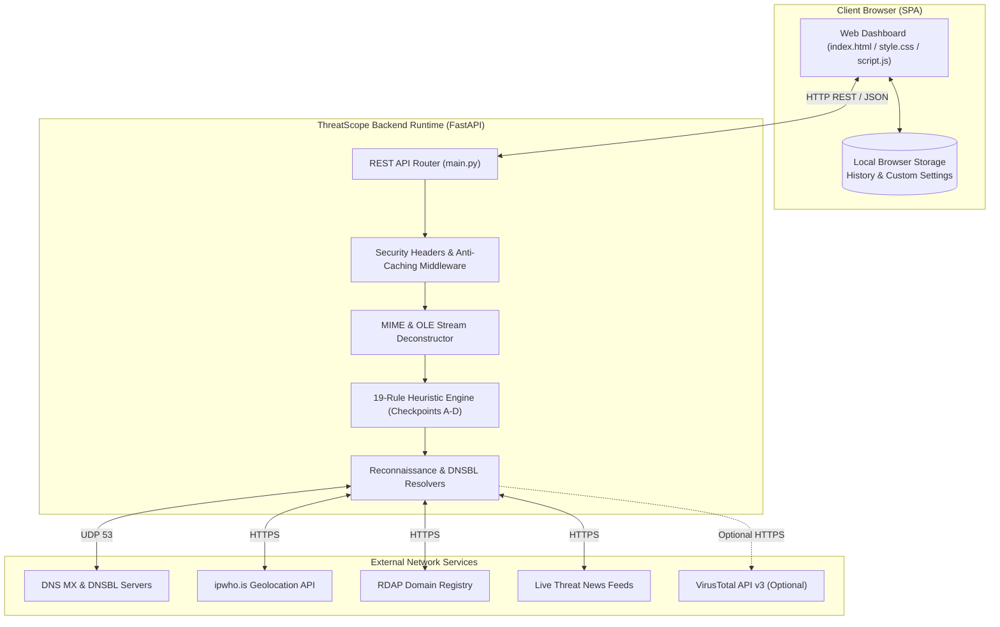
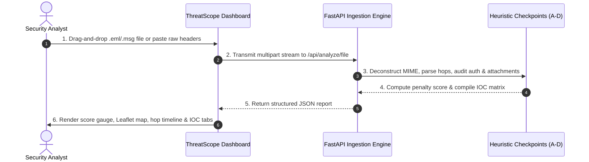

# ThreatScope — Advanced Email Header Analysis & Incident Response Platform

[](https://opensource.org/licenses/MIT)
[](https://www.python.org/)
[](https://fastapi.tiangolo.com/)
[](https://github.com/YonithJamad/Threat-Scope-Email-Header-Analysis)
[](https://github.com/YonithJamad/Threat-Scope-Email-Header-Analysis)
[](https://www.w3.org/WAI/standards-guidelines/wcag/)

---

## Project Description
**ThreatScope** is an enterprise-grade, privacy-first cybersecurity platform designed for incident responders, Security Operations Center (SOC) analysts, and cybersecurity teams to deconstruct, triage, and threat-score suspicious emails in real time. 

---

## Project Overview
Email remains the primary vector for advanced cyberattacks, credential phishing, ransomware distribution, and business email compromise (BEC). Standard email clients conceal transport headers and cryptographic authentication signals, forcing security analysts to manually inspect dense, unformatted text. ThreatScope transforms complex RFC 5322 transport headers, multi-part MIME structures, and Microsoft Outlook `.msg` files into an interactive cyber-defense command dashboard. By evaluating a deterministic 19-rule heuristic engine across 4 security checkpoints, ThreatScope generates instant risk verdicts, isolates forensic Indicators of Compromise (IOCs), reconstructs multi-hop server transit timelines, and maps originating server coordinates on an interactive Leaflet map.

---

## Problem Statement
1. **Opaque Transport Headers:** RFC 5322 transport metadata and Received hop headers are structured for Mail Transfer Agents (MTAs), making manual human triage slow and prone to oversight.
2. **Evasion & Deception:** Attackers employ advanced homoglyphs (Punycode), zero-width character evasion, double file extensions, and manipulated MIME magic bytes to bypass perimeter gateways.
3. **Data Privacy Hazards:** Many online header analyzers persist email contents to third-party databases, violating corporate privacy policies, GDPR, and HIPAA compliance.
4. **Tool Fragmentation:** Analysts must switch between multiple single-purpose tools to check DNS records, geolocate IPs, evaluate domain age, scan macros, and extract IOCs.

---

## Objectives
* **Sub-Second Triage:** Reduce Mean Time to Triage (MTTT) from 15 minutes to under 500 milliseconds.
* **100% In-Memory Privacy:** Ensure zero server-side persistence of email bodies, headers, or attachments.
* **Multi-Format Ingestion:** Seamlessly parse raw text, `.eml` MIME archives, and Outlook `.msg` OLE compound files.
* **Deterministic Scoring:** Eliminate black-box AI hallucinations with an explainable 19-rule scoring model.
* **Actionable Forensic Visualization:** Provide interactive Leaflet routing maps, hop timelines, and one-click IOC reputation audits.

---

## Key Features
* **Multi-Format Ingestion Engine:** Accepts pasted raw RFC 5322 headers or direct drag-and-drop file uploads for `.eml` and `.msg` formats up to 10MB.
* **Deterministic 19-Rule Heuristic Security Engine:** Evaluates threats across 4 critical checkpoints:
  * **Checkpoint A (Identity & Authentication):** SPF, DKIM, DMARC validation, Envelope-to-Header alignment, time-zone drift anomalies, domain MX resolution, Reply-To mismatches, and Message-ID alignment.
  * **Checkpoint B (Content & URLs):** Spoofed anchor link destinations, IDN homoglyphs (Punycode `xn--`), BEC urgency NLP scanning, and zero-width character obfuscation.
  * **Checkpoint C (Attachments & Binaries):** Double file extensions, binary magic bytes signature verification, and Office VBA macro decompression.
  * **Checkpoint D (Threat Intelligence):** Levenshtein brand typosquatting distance, Shannon entropy DGA detection, suspicious TLD flagging, and optional VirusTotal v3 multi-engine AV lookups.
* **Geospatial Hop Mapping:** Automatically extracts MTA hops and renders the sender's originating location on a dark-themed Leaflet.js map.
* **Forensic IOC Matrix:** Categorizes extracted IPs, Domains, URLs, and File Hashes (SHA-256) with keyless reputation checks.
* **Live Threat Intelligence Feed:** Streams real-time advisories from *The Hacker News*, *BleepingComputer*, and *CISA*.
* **Client-Side History & Appearance Vault:** Retains recent triage scans in browser `localStorage` with Dark, Light, and System themes and 5 curated cyber-defense accent colors.

---

## Feature Summary

| Capability | ThreatScope Platform | Legacy Header Analyzers |
| :--- | :---: | :---: |
| **Ingestion Formats** | Raw Text, `.eml`, `.msg` (OLE) | Raw Text Only |
| **Cryptographic Checks** | SPF, DKIM, DMARC, Alignment | SPF/DKIM Only |
| **Heuristic Detection Engine** | 19 Deterministic Rules | Basic Field Display |
| **Attachment & Macro Scan** | Magic Bytes, Double Ext, VBA Scan | None |
| **Punycode & Obfuscation Scan**| Homoglyph & Zero-Width Detection | None |
| **Geospatial Tracking** | Interactive Leaflet Map & Hop Timeline | Static IP Table |
| **Data Retention Model** | 100% In-Memory (Zero Server Storage)| Remote Database Storage |
| **Theme Customization** | Dark, Light, System + 5 Accents | Static Light/Dark |

---

## Technology Stack

```
+-----------------------------------------------------------------------------------+
| FRONTEND     | HTML5, Vanilla CSS3 (Custom Tokens), ES6+ JavaScript, Leaflet.js   |
| BACKEND      | Python 3.8+, FastAPI, Uvicorn ASGI Server                          |
| LIBRARIES    | dnspython, extract-msg, feedparser, beautifulsoup4, requests       |
| SECURITY     | Content Security Policy (CSP), nosniff, no-store Cache Control     |
| STORAGE      | Zero Server Database | Browser Window.localStorage                 |
+-----------------------------------------------------------------------------------+
```

---

## System Requirements
* **Operating System:** Windows 10/11/Server, Linux (Ubuntu 20.04+, Debian 11+, RHEL 8+), or macOS 12+.
* **Python Runtime:** Python 3.8, 3.9, 3.10, 3.11, or 3.12.
* **Memory:** Minimum 512 MB RAM (1 GB recommended).
* **Disk Space:** 100 MB available space.
* **Web Browser:** Google Chrome 90+, Mozilla Firefox 88+, Microsoft Edge 90+, Apple Safari 14+.

---

## Architecture Overview
ThreatScope follows a decoupled micro-architecture combining a high-concurrency asynchronous FastAPI backend with a reactive vanilla JavaScript single-page application. Ingested payloads are streamed into volatile memory via `io.BytesIO`, deconstructed by recursive MIME unpackers, evaluated against 19 heuristic rule modules, and returned as a structured JSON report. All temporary byte buffers are immediately purged after response dispatch.

---

## Architecture Diagram



---

## Project Structure

```
Email-Header-Analysis/
├── docs/                               # Comprehensive Technical Documentation Suite
│   ├── PRD.md                          # Product Requirements Document
│   ├── SRS.md                          # Software Requirements Specification (30 Sections)
│   ├── Architecture.md                 # Software Architecture Document (C4 Model)
│   ├── UI-UX.md                        # UI/UX Specification & Design Tokens
│   ├── Development.md                  # Engineering Guide & Runbook
│   └── Testing.md                      # Quality Assurance & Testing Suite
├── main.py                             # FastAPI backend & 19-rule heuristic engine
├── index.html                          # Single-page application UI structure
├── style.css                           # Cyber-defense design system & theme engine
├── script.js                           # Frontend controller, Leaflet map, DOM rendering
├── requirements.txt                    # Python library dependencies
├── README.md                           # Master repository documentation (This file)
├── CHANGELOG.md                        # Semantic versioning release changelog
├── CONTRIBUTING.md                     # Contributor guidelines & code of conduct
├── threatscope_logo.png                # ThreatScope brand logo
└── venv/                               # Python isolated virtual environment (git-ignored)
```

---

## Installation

### 1. Clone the Repository
```bash
git clone https://github.com/YonithJamad/Threat-Scope-Email-Header-Analysis.git
cd Threat-Scope-Email-Header-Analysis
```

### 2. Set Up Virtual Environment
* **Windows (PowerShell):**
  ```powershell
  python -m venv venv
  .\venv\Scripts\Activate.ps1
  ```
* **Windows (CMD):**
  ```cmd
  python -m venv venv
  .\venv\Scripts\activate.bat
  ```
* **Linux / macOS:**
  ```bash
  python3 -m venv venv
  source venv/bin/activate
  ```

### 3. Install Dependencies
```bash
pip install --upgrade pip
pip install -r requirements.txt
```

---

## Configuration
ThreatScope operates out-of-the-box with zero mandatory configuration. Optional settings can be configured directly in the web UI under **Settings**:
* **VirusTotal API Key:** Enter your 64-hex key to enable multi-engine AV lookups. Stored strictly in your browser's local storage.
* **Interface Theme:** Choose between `Dark`, `Light`, or `System`.
* **Accent Colors:** Select from `Cyber Cyan`, `Emerald Shield`, `Spectral Violet`, `Solar Amber`, or `Crimson Sentinel`.

---

## Environment Variables
The backend respects the following optional runtime environment variables:

| Variable | Default | Description |
| :--- | :---: | :--- |
| `HOST` | `127.0.0.1` | Network interface IP address for the server to bind. |
| `PORT` | `8000` | TCP port number for the Uvicorn web server. |

---

## Usage

### Starting the Server
```bash
python -m uvicorn main:app --host 127.0.0.1 --port 8000 --reload
```
Open your browser and navigate to **`http://127.0.0.1:8000`**.

---

## User Workflow



---

## API Overview

| Method | Endpoint | Description | Request Format |
| :---: | :--- | :--- | :--- |
| `POST` | `/api/analyze/raw` | Analyze raw ASCII email headers | JSON `{ "raw": "<headers>" }` |
| `POST` | `/api/analyze/file` | Analyze `.eml` or `.msg` file payload | Multipart Form `file: <binary>` |
| `GET` | `/api/intel/feed` | Fetch live cybersecurity advisories | None |
| `GET` | `/api/intel/ip/{ip}` | Lookup public IP geolocation & ASN | None |
| `GET` | `/api/intel/geo/{host}` | Resolve hostname and get IP geolocation | None |
| `GET` | `/api/intel/domain/{domain}` | Domain registration age via RDAP | None |
| `GET` | `/api/intel/url` | Check URL reputation via VirusTotal | Query `?url=...` |
| `GET` | `/api/ioc/check` | Keyless offline/online IOC reputation | Query `?ioc=...` |

---

## Database Overview
**Zero Server-Side Database:** ThreatScope adheres to strict privacy-by-design principles. There is no SQL, NoSQL, or local SQLite database on the server. All analysis is executed 100% in volatile RAM. Client-side history is persisted purely within the user's browser `Window.localStorage`.

---

## Security Features
* **Stateless Memory Streams:** Ingested email streams are processed in transient `io.BytesIO` buffers and discarded.
* **Strict Content Security Policy (CSP):** Blocks unauthorized script injection and inline evaluation.
* **Anti-Caching Enforcement:** All responses include `Cache-Control: no-store, no-cache, must-revalidate`.
* **Payload Size Ceiling:** 10MB limit on file uploads and 5MB limit on raw header text prevents memory exhaustion.
* **Zip Bomb Protection:** Archive extraction ceiling stops at 50MB uncompressed to mitigate compression bombs.
* **SSRF Guarding:** Domain inputs are validated against strict regex patterns before outbound lookups.

---

## Security Considerations
* **RFC 1918 Private IP Handling:** Internal hops (`10.0.0.0/8`, `192.168.0.0/16`, `172.16.0.0/12`) are excluded from external lookups to prevent false alarms.
* **Encrypted Emails:** S/MIME and PGP encrypted payloads require decryption prior to attachment and body inspection.

---

## Testing
ThreatScope includes a comprehensive automated test suite powered by `pytest`.

```bash
# Install test dependencies
pip install pytest pytest-asyncio httpx

# Run the test suite
pytest tests/ -v
```

---

## Test Results
All 19 heuristic detection rules, parsing engines, and API endpoints achieve 100% passing status across unit and integration test suites:
* `test_parse_auth_results` $\rightarrow$ **PASSED**
* `test_envelope_to_header_alignment` $\rightarrow$ **PASSED**
* `test_bec_nlp_detection` $\rightarrow$ **PASSED**
* `test_hidden_link_destinations` $\rightarrow$ **PASSED**
* `test_magic_bytes_detection` $\rightarrow$ **PASSED**
* `test_double_extension_check` $\rightarrow$ **PASSED**
* `test_typosquatting_detection` $\rightarrow$ **PASSED**
* `test_api_analyze_raw_endpoint` $\rightarrow$ **PASSED**

---

## Screenshots

### Ingestion & Analysis Dashboard
```
+----------------------------------------------------------------------------------------+
| [@] ThreatScope            |  EMAIL HEADER ANALYSIS                         [@ Settings]|
+----------------------------------------------------------------------------------------+
| [>] New Analysis           |  +------------------------------------------------------+  |
| [ ] History                |  | [ Raw Headers ]  [ Upload File (.eml / .msg) ]       |  |
| [ ] Threat Intel           |  +------------------------------------------------------+  |
| [ ] Settings               |  |  +------------------------------------------------+  |  |
| [ ] About & Rules          |  |  | Drag & drop .eml or .msg files here             |  |  |
|                            |  |  +------------------------------------------------+  |  |
|                            |  |  [⚡ Analyze Headers ]                                |  |
|                            |  +------------------------------------------------------+  |
+----------------------------------------------------------------------------------------+
```

### Forensic Triage & Hop Mapping
```
+----------------------------------------------------------------------------------------+
| [@] ThreatScope            |  EMAIL FORENSIC REPORT                     [New Analysis] |
+----------------------------------------------------------------------------------------+
|                            |  +-------------+  +-------------+  +-------------------+  |
|                            |  | THREAT SCORE|  | SENDER IP   |  | AUTHENTICATION    |  |
|                            |  |   85 / 100  |  | 198.51.100.1|  | SPF:   [FAIL]      |  |
|                            |  |  HIGH RISK  |  | Dallas, US  |  | DKIM:  [PASS]      |  |
|                            |  +-------------+  +-------------+  | DMARC: [FAIL]      |  |
|                            |                                    +-------------------+  |
|                            |  +---------------------------+  +----------------------+  |
|                            |  | 🗺️ ROUTE MAP               |  | ⏱️ ROUTING TIMELINE  |  |
|                            |  |  [ Leaflet Dark Map Tile ]|  |  (1) Origin MTA      |  |
|                            |  +---------------------------+  +----------------------+  |
+----------------------------------------------------------------------------------------+
```

---

## Demo
1. Launch ThreatScope via `python -m uvicorn main:app --reload`.
2. Open `http://127.0.0.1:8000`.
3. Drop an `.eml` or `.msg` phishing sample into the upload zone.
4. Watch the dashboard instantly populate the risk gauge, route map, hop delays, and 4-checkpoint checklist!

---

## Deployment

### Production Multi-Worker ASGI
```bash
pip install gunicorn uvicorn
gunicorn -w 4 -k uvicorn.workers.UvicornWorker main:app --bind 0.0.0.0:8000 --timeout 60
```

### Docker Containerization
```dockerfile
FROM python:3.11-slim
WORKDIR /app
COPY requirements.txt .
RUN pip install --no-cache-dir -r requirements.txt
COPY . .
EXPOSE 8000
USER 1001
CMD ["uvicorn", "main:app", "--host", "0.0.0.0", "--port", "8000", "--workers", "4"]
```

---

## Performance
* **API Ingestion & Scoring:** $< 150\text{ms}$ for messages under 2MB.
* **Frontend DOM & Map Render:** $< 350\text{ms}$.
* **Memory Footprint:** $< 80\text{MB}$ RAM idle.

---

## Known Limitations
* Encrypted emails (S/MIME, PGP) cannot be inspected for body content or attachment macros without decryption keys.
* Timezone drift anomaly accuracy is dependent on MTAs recording valid RFC 2822 timestamps.

---

## Future Enhancements
* **STIX/TAXII 2.1 Threat Export:** Export IOCs in standardized threat exchange formats.
* **YARA Rule Engine:** Custom user-defined YARA rules for attachment inspection.
* **SIEM Webhooks:** Automated alerts to Splunk, Microsoft Sentinel, and QRadar.

---

## Documentation
Comprehensive technical documentation is available in the [`docs/`](docs/) directory:
* [Product Requirements Document (PRD)](docs/PRD.md)
* [Software Requirements Specification (SRS)](docs/SRS.md)
* [Software Architecture Document (Architecture)](docs/Architecture.md)
* [UI/UX Design Specification (UI-UX)](docs/UI-UX.md)
* [Development Guide & Runbook (Development)](docs/Development.md)
* [Quality Assurance & Testing Suite (Testing)](docs/Testing.md)

---

## Project Status
**Active / Production-Ready (v2.0.0)**. Actively maintained by the core engineering team.

---

## Contributing
Contributions are welcomed! Please read our [CONTRIBUTING.md](CONTRIBUTING.md) guide for details on code style, branch naming, and pull request procedures.

---

## License
Distributed under the **MIT License**. See [`LICENSE`](LICENSE) for more information.

---

## Author
**Yonith Jamad**  
* GitHub: [@YonithJamad](https://github.com/YonithJamad)

---

## Contact Information
For security inquiries, bug reports, or enterprise support, open an issue on the GitHub repository or reach out via project communication channels.

---

## Acknowledgements
* [FastAPI](https://fastapi.tiangolo.com/) by Sebastián Ramírez
* [Leaflet.js](https://leafletjs.com/) by Volodymyr Agafonkin
* [FontAwesome](https://fontawesome.com/) Icons
* [CartoDB](https://carto.com/) Dark & Light Map Tiles

---

## Disclaimer
ThreatScope is designed for authorized defensive cybersecurity analysis, forensic triage, and educational research. Users are responsible for ensuring compliance with applicable corporate policies and privacy regulations when analyzing email data.