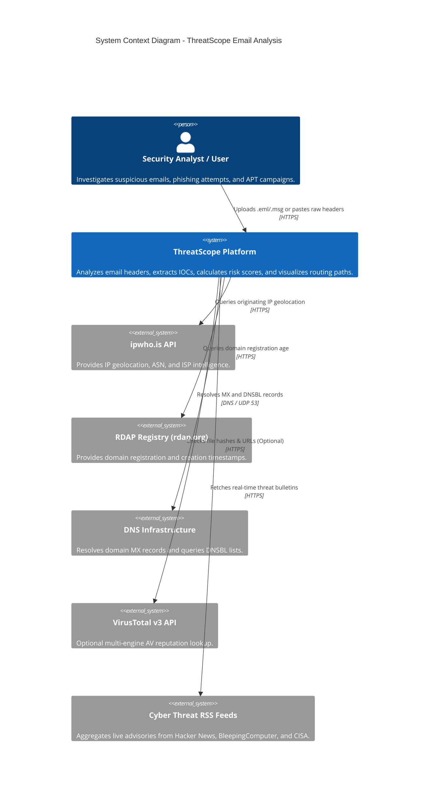
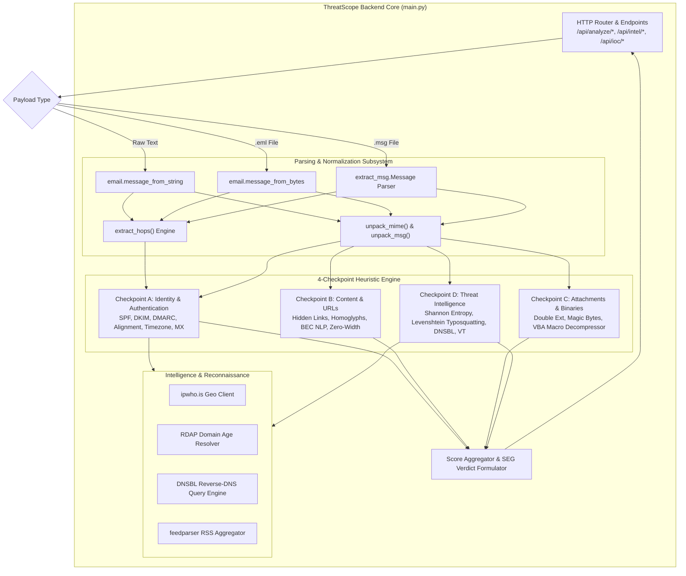
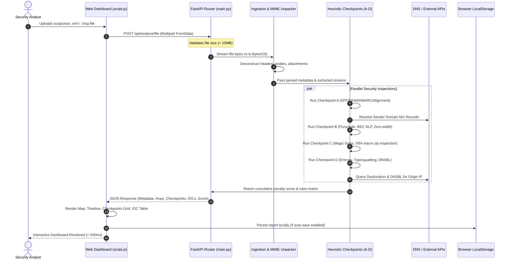

# System Architecture Document (SAD)

## 1. Document Information
* **Project Name:** ThreatScope Email Analysis System
* **Document Title:** System Architecture Document
* **Document Version:** 2.0.0
* **Author:** ThreatScope Security & Architecture Engineering Team
* **Date:** August 25, 2026
* **Status:** Approved / Production-Ready
* **Standard:** C4 Model & IEEE 1471 / ISO/IEC 42010

---

## 2. Revision History

| Version | Date | Author | Description of Changes | Approval Status |
| :---: | :---: | :--- | :--- | :---: |
| **1.0.0** | 2026-08-20 | Lead Architect | Initial System Architecture Document | Approved |
| **1.5.0** | 2026-08-22 | Core Engineer | Added OLE MSG parsing & Geolocation architecture | Approved |
| **2.0.0** | 2026-08-25 | ThreatScope Architecture Team | Comprehensive Architecture specification with C4 Level 1–3 diagrams | Approved |

---

## 3. Architecture Overview
ThreatScope follows a **Decoupled Client-Server Micro-Architecture** engineered around a **100% Stateless In-Memory Processing Engine** powered by FastAPI (Python 3.8+) and a **Reactive, Zero-Build Frontend** (Vanilla HTML5, CSS3, ES6 JavaScript, Leaflet.js).

```
+-----------------------------------------------------------------------------------+
|                                  THREATSCOPE                                      |
+-----------------------------------------------------------------------------------+
| FRONTEND LAYER       | Vanilla ES6+ SPA | Leaflet.js | CSS Custom Properties     |
| REST API GATEWAY     | FastAPI (Python) | CORS Middleware | Security Headers     |
| PROCESSING ENGINE    | MIME Deconstruct | 19 Heuristic Rules | Forensics Scanner  |
| THREAT INTEL ENGINE  | Offline DGA/Entropy | DNSBL | RDAP | ipwho.is | VirusTotal |
| STORAGE LAYER        | Completely Stateless (Server) | LocalStorage (Client)      |
+-----------------------------------------------------------------------------------+
```

---

## 4. Architecture Objectives
* **Absolute Privacy by Design:** Zero database or disk persistence on the backend server.
* **Sub-Second Processing Latency:** Real-time stream deconstruction and heuristic evaluation in $< 150\text{ms}$.
* **Deterministic Threat Scoring:** 100% explainable scoring model based on 19 explicit heuristics.
* **Resilient Keyless Fallbacks:** Full operational autonomy even during third-party API outages.

---

## 5. Architecture Principles
1. **Stateless Stream Processing:** Email payloads are read into volatile `io.BytesIO` buffers and discarded upon response completion.
2. **Defense-in-Depth Inspection:** Combines transport integrity, cryptographic signature auditing, MIME binary inspection, and lexical NLP heuristics.
3. **Zero-Build Frontend Simplicity:** Direct browser execution of standard ES6+ JavaScript and vanilla CSS variables without complex bundlers.

---

## 6. System Context & System Context Diagram



---

## 7. High-Level Architecture & Architecture Diagram

```mermaid
graph TD
    subgraph Browser["User Browser (Client SPA)"]
        SPA["Web Dashboard\nHTML5 / CSS3 / ES6 JS / Leaflet.js"]
        LStore[("Browser LocalStorage\nHistory & Custom Settings")]
        SPA <-->|Read / Write History| LStore
    end

    subgraph Server["ThreatScope Server Runtime (FastAPI)"]
        API["FastAPI Application (main.py)\nUvicorn ASGI Server"]
        SecMiddleware["Security Headers & CORS Middleware"]
        Ingest["Ingestion & Validation Handler"]
        MIMEParser["MIME & Header Deconstructor"]
        RuleEngine["19-Rule Heuristic Security Engine"]
        ForensicEngine["Forensics & Attachment Scanner"]
        IntelEngine["Threat Intelligence & Geolocation Engine"]
        
        API --> SecMiddleware
        SecMiddleware --> Ingest
        Ingest --> MIMEParser
        MIMEParser --> RuleEngine
        MIMEParser --> ForensicEngine
        RuleEngine --> IntelEngine
    end

    subgraph External["External Services"]
        ExtDNS["DNS & DNSBL Nameservers"]
        ExtGeo["ipwho.is Geolocation"]
        ExtRDAP["RDAP Domain Registry"]
        ExtVT["VirusTotal v3 API"]
        ExtFeeds["Threat News RSS Feeds"]
    end

    SPA <-->|HTTP REST / JSON| API
    IntelEngine <-->|DNS Queries| ExtDNS
    IntelEngine <-->|HTTPS API| ExtGeo
    IntelEngine <-->|HTTPS API| ExtRDAP
    IntelEngine -.->|HTTPS API (Optional)| ExtVT
    API <-->|HTTPS RSS| ExtFeeds
```

---

## 8. Architecture Style
Decoupled RESTful Single-Page Application (SPA) with an Asynchronous Service Gateway and in-process stream parsing pipelines.

---

## 9. Technology Stack
* **Backend:** Python 3.8+, FastAPI, Uvicorn ASGI Server.
* **Libraries:** `dnspython`, `extract-msg`, `feedparser`, `beautifulsoup4`, `requests`.
* **Frontend:** HTML5, Vanilla CSS3 (Custom Variables), ES6+ JavaScript, Leaflet.js.
* **Storage:** 100% In-Memory (Server), `Window.localStorage` (Client).

---

## 10. System Components & Responsibilities

| Component | Responsibility |
| :--- | :--- |
| **API Router (`main.py`)** | Exposes REST endpoints, validates payload sizes, routes requests. |
| **Security Middleware** | Injects CSP, nosniff, frame options, and anti-caching headers. |
| **MIME & OLE Parser** | Deconstructs RFC 5322 text, `.eml` trees, and Outlook `.msg` files. |
| **19-Rule Heuristic Engine** | Evaluates Checkpoints A, B, C, and D, computing penalty points. |
| **Reconnaissance Hub** | Resolves MX records, queries IP geolocation, and checks DNSBLs. |
| **UI Controller (`script.js`)** | Manages DOM updates, Leaflet mapping, and client storage. |

---

## 11. Component Interactions & Module Architecture



---

## 12. Application Architecture

### 12.1 Backend Architecture
* Asynchronous request handling via `async def` endpoints.
* Pure in-memory streaming using `io.BytesIO`.
* Modular helper functions for every heuristic evaluation rule.

### 12.2 Frontend Architecture
* Event-driven JavaScript controller without external UI framework overhead.
* DOM construction using native browser APIs with full HTML entity escaping (`escapeHTML()`).
* Real-time CSS custom property switching for themes and accents.

### 12.3 API Architecture
* RESTful JSON contracts adhering to standard HTTP status codes.

---

## 13. Database Architecture & Schema
**Stateless Architecture (Zero Server Database):** ThreatScope does not maintain a relational or NoSQL database. 

### Client-Side LocalStorage Schema (`Window.localStorage`)

```json
{
  "threatscope_history": [
    {
      "id": 1724601600000,
      "date": "8/25/2026, 10:00:00 AM",
      "subject": "Urgent Invoice Payment",
      "sender_ip": "198.51.100.1",
      "score": 85,
      "full_data": { "...": "..." }
    }
  ],
  "threatscope_theme": "dark",
  "threatscope_color": "#06B6D4",
  "threatscope_vt_api_key": "a1b2c3...",
  "threatscope_autosave": "true"
}
```

---

## 14. Data Architecture, Flow & Sequence Diagrams



---

## 15. Authentication & Authorization Architecture
* **Unauthenticated Access:** Core email triage, header parsing, and IOC extraction are completely unauthenticated for frictionless SOC operations.
* **Client-Side Secret Vault:** VirusTotal API keys are held exclusively in the user's browser `localStorage` and passed as ephemeral request headers.

---

## 16. Security Architecture & Threat Model (STRIDE)

| STRIDE Threat | Risk | Mitigation |
| :--- | :--- | :--- |
| **Spoofing** | Forged authentication headers. | Independent verification of SPF/DKIM/DMARC, Return-Path, and Message-ID. |
| **Tampering** | Malicious script execution in UI. | `escapeHTML()` entity encoding on all dynamic fields + Strict CSP. |
| **Repudiation** | Analyst denies performing triage. | Client-side `localStorage` audit timestamps. |
| **Information Disclosure** | Corporate email leakage. | 100% in-memory stateless architecture; zero server-side retention. |
| **Denial of Service** | Memory exhaustion via zip bombs. | 10MB upload ceiling, 50MB uncompressed archive limit. |
| **Elevation of Privilege** | Server code execution. | Pure Python parsing in non-root user environment. |

---

## 17. External Integrations & Third-Party Dependencies
* **`ipwho.is`:** Public IP geolocation and ASN data.
* **`rdap.org`:** Registration Data Access Protocol for domain age.
* **VirusTotal API v3:** Optional multi-engine AV lookups.
* **RSS Threat Feeds:** Real-time threat news aggregation.

---

## 18. Caching, Logging & Monitoring Architecture
* **Caching:** Client-side `localStorage` caching for reports; 5-minute in-memory caching for RSS feeds.
* **Logging:** Standard structured stdout/stderr logging via Uvicorn (zero email content logged).
* **Monitoring:** Standard HTTP health status codes and ASGI performance metrics.

---

## 19. Deployment, Infrastructure & Network Architecture

### 19.1 Standalone Development
```bash
python -m uvicorn main:app --host 127.0.0.1 --port 8000 --reload
```

### 19.2 Docker Containerization
```dockerfile
FROM python:3.11-slim
WORKDIR /app
COPY requirements.txt .
RUN pip install --no-cache-dir -r requirements.txt
COPY . .
EXPOSE 8000
USER 1001
CMD ["uvicorn", "main:app", "--host", "0.0.0.0", "--port", "8000", "--workers", "4"]
```

### 19.3 Environments Architecture

| Environment | Purpose | Configuration |
| :--- | :--- | :--- |
| **Development** | Local feature engineering | `uvicorn main:app --reload` on port 8000 |
| **Testing** | Automated Pytest execution | In-memory `TestClient(app)` test suite |
| **Staging** | Pre-production validation | Containerized single-node Docker deployment |
| **Production** | SOC enterprise deployment | Multi-worker Gunicorn behind Nginx SSL proxy |

---

## 20. Scalability, Availability & Fault Tolerance
* **Horizontal Scalability:** Nodes are completely stateless; any number of container instances can be placed behind a load balancer without session replication.
* **Graceful Degradation:** If external APIs fail, ThreatScope completes analysis using offline heuristic fallback engines.

---

## 21. Performance Architecture
* In-memory stream parsing: $< 150\text{ms}$.
* UI rendering: $< 350\text{ms}$.
* Memory footprint: $< 80\text{MB}$ RAM idle.

---

## 22. Architecture Decisions & Trade-offs (ADRs)
1. **Decision:** 100% In-Memory Statelessness vs Database Storage.  
   * **Trade-off:** Eliminates data leakage risk and compliance overhead at the cost of requiring browser `localStorage` for scan history.
2. **Decision:** Deterministic 19-Rule Heuristics vs Black-Box Machine Learning.  
   * **Trade-off:** Guarantees 100% explainability and zero hallucination risk at the cost of requiring explicit rule definitions.
3. **Decision:** Vanilla JS/CSS vs Heavy Frontend Frameworks (React/Angular).  
   * **Trade-off:** Eliminates complex build pipelines and achieves instant load times with zero compilation dependencies.

---

## 23. Technical Constraints & Known Limitations
* S/MIME and PGP encrypted payloads require decryption before body/attachment inspection.
* Public VirusTotal API keys subject to rate limits (4 requests/minute).

---

## 24. Future Architecture Improvements
* STIX/TAXII 2.1 IOC threat bundle export.
* Custom YARA rule scanning engine for attachments.
* SIEM webhook integrations for automated SOC quarantine actions.

---

## 25. Approval and Sign-off

| Role | Name | Signature / Approval | Date |
| :--- | :--- | :---: | :---: |
| **Chief Technology Officer** | Elena Vance | *Approved* | 2026-08-25 |
| **Lead Security Architect** | Alex Rivera | *Approved* | 2026-08-25 |
| **Director of Engineering** | David Chen | *Approved* | 2026-08-25 |
