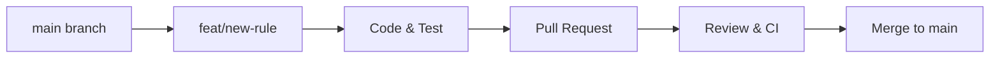

# Software Development Document & Engineering Runbook

## 1. Document Information
* **Project Name:** ThreatScope Email Analysis System
* **Document Title:** Software Development Document
* **Document Version:** 2.0.0
* **Author:** ThreatScope Core Engineering Team
* **Date:** August 25, 2026
* **Status:** Approved / Production-Ready

---

## 2. Revision History

| Version | Date | Author | Description of Changes | Approval Status |
| :---: | :---: | :--- | :--- | :---: |
| **1.0.0** | 2026-08-20 | Lead Backend Engineer | Initial engineering handbook | Approved |
| **1.5.0** | 2026-08-22 | Full-Stack Developer | Added frontend rendering lifecycle & runbooks | Approved |
| **2.0.0** | 2026-08-25 | ThreatScope Engineering Team | Comprehensive development specification with full deployment runbooks | Approved |

---

## 3. Development Overview & Objectives
This document serves as the master engineering guide for developing, maintaining, and deploying the **ThreatScope** Email Header Analysis platform. 

### Development Objectives
* Maintain a clean, decoupled micro-architecture with zero server-side state.
* Enforce rigorous PEP 8 (Python) and modern ES6+ coding standards.
* Ensure deterministic, sub-second execution for all 19 heuristic security rules.

---

## 4. Technology Stack
* **Programming Languages:** Python 3.8+ (Backend), JavaScript ES6+ (Frontend), HTML5, CSS3.
* **Frameworks:** FastAPI (REST API Engine), Uvicorn (ASGI Web Server).
* **Libraries:** `dnspython`, `extract-msg`, `feedparser`, `beautifulsoup4`, `requests`.
* **Development Tools:** VS Code, PyCharm, Antigravity IDE, Git, Pytest, Flake8, Black, Bandit.

---

## 5. System Requirements & Development Environment
* **OS:** Windows 10/11/Server, Linux (Ubuntu 20.04+), macOS 12+.
* **Python Runtime:** Python 3.8 to 3.12 (Python 3.10+ recommended).
* **RAM:** Minimum 512 MB available memory.
* **Disk Space:** 100 MB available space.

---

## 6. Repository Structure & Source Code Organization

```
Email-Header-Analysis/
├── docs/                               # Technical Documentation Suite
│   ├── PRD.md                          # Product Requirements Document
│   ├── SRS.md                          # Software Requirements Specification (30 Sections)
│   ├── Architecture.md                 # System Architecture Document (C4 Model)
│   ├── UI-UX.md                        # UI/UX Specification & Design Tokens
│   ├── Development.md                  # Development Guide & Runbook (This file)
│   └── Testing.md                      # QA & Test Suite Specification
├── tests/
│   └── test_threatscope.py             # Automated Pytest Suite covering 19 rules
├── main.py                             # Core FastAPI backend & 19-rule heuristic engine
├── index.html                          # Single-page application UI structure
├── style.css                           # Cyber-defense design system & theme engine
├── script.js                           # Frontend controller, Leaflet map, DOM rendering
├── requirements.txt                    # Python library dependencies
├── README.md                           # Master repository documentation (37 sections)
├── CHANGELOG.md                        # Semantic versioning release changelog
├── CONTRIBUTING.md                     # Contributor guidelines & code of conduct
├── threatscope_logo.png                # ThreatScope brand logo
└── venv/                               # Python isolated virtual environment (git-ignored)
```

---

## 7. Coding Standards & Conventions

### 7.1 Python Standards
* Adhere strictly to **PEP 8**.
* Use explicit type annotations for all functions:
  ```python
  def check_typosquatting(domain: str) -> tuple[bool, str]:
  ```
* Snake_case for functions and variables (`analyze_message`, `raw_headers`).
* PascalCase for Pydantic models (`RawHeadersInput`).

### 7.2 JavaScript Standards
* Use modern ES6+ features (`const`/`let`, arrow functions, `async`/`await`).
* Always escape dynamic strings with `escapeHTML()` before DOM injection to prevent XSS.
* CamelCase for JavaScript variables and functions (`renderResults`, `updateThreatScore`).

### 7.3 CSS Standards
* Use CSS Custom Properties defined in `:root` for all color and layout tokens.
* Maintain WCAG 2.1 AA compliant contrast ratios across Dark and Light modes.

---

## 8. Branching Strategy & Git Workflow



* **Branch Naming:**
  * `feat/<name>`: New feature or rule additions.
  * `fix/<name>`: Bug fixes and security patches.
  * `docs/<name>`: Documentation updates.
* **Commit Guidelines:** Conventional Commits (`feat:`, `fix:`, `docs:`, `refactor:`, `test:`).

---

## 9. Installation & Initial Setup

### 1. Clone the Codebase
```bash
git clone https://github.com/YonithJamad/Threat-Scope-Email-Header-Analysis.git
cd Threat-Scope-Email-Header-Analysis
```

### 2. Set Up Virtual Environment
* **Windows (PowerShell):**
  ```powershell
  python -m venv venv
  .\venv\Scripts\Activate.ps1
  ```
* **Linux / macOS:**
  ```bash
  python3 -m venv venv
  source venv/bin/activate
  ```

### 3. Install Dependencies
```bash
pip install --upgrade pip
pip install -r requirements.txt
```

---

## 10. Database Setup & Migrations
**Zero Server Database:** ThreatScope operates 100% in-memory. There are no SQL migrations or database setup steps required.

---

## 11. Application Configuration & Startup

### Environment Variables
* `HOST`: Server listening interface (Default: `127.0.0.1`).
* `PORT`: Server listening port (Default: `8000`).

### Starting the Development Server
```bash
python -m uvicorn main:app --host 127.0.0.1 --port 8000 --reload
```
Access the application at **`http://127.0.0.1:8000`**.

---

## 12. Core Development Deep-Dives

### 12.1 Backend Development (`main.py`)
* **Security Middleware:** Injects CSP, X-Frame-Options, and anti-caching headers on all responses.
* **MIME Deconstructor:** `unpack_mime()` traverses multipart bodies and extracts plain text, HTML, and binary attachment streams.
* **MSG Deconstructor:** `unpack_msg()` extracts properties from Outlook OLE compound files via `extract-msg`.

### 12.2 Recipe: Adding a New Heuristic Detection Rule
To introduce a new heuristic rule to the 4-checkpoint engine:

1. **Write Detection Function:**
   ```python
   def check_custom_threat_rule(msg):
       custom_val = msg.get('X-Custom-Threat-Header')
       if custom_val and 'phish' in custom_val.lower():
           return True, "Custom threat signature identified."
       return False, "Header clean."
   ```
2. **Register in `analyze_message()`:**
   ```python
   is_flagged, desc = check_custom_threat_rule(msg)
   checkpoint_a_rules.append({
       'id': 'custom_threat_rule',
       'name': 'Custom Threat Header Check',
       'triggered': is_flagged,
       'status': 'triggered' if is_flagged else 'passed',
       'penalty': 20 if is_flagged else 0,
       'description': desc
   })
   if is_flagged:
       score += 20
   ```
3. **Frontend Autoload:** The UI dynamically renders the new rule in the Checkpoints grid automatically.

### 12.3 Frontend Development (`script.js` & `style.css`)
* **DOM Pipeline (`renderResults`):** Updates auth badges, populates timeline, initializes Leaflet map, renders metadata grid, injects 4-column checkpoints, and caches scan to `localStorage`.
* **Theme Switching:** Modifies CSS Custom Properties dynamically via `applyTheme()` and `applyColor()`.

---

## 13. Security Implementation & Input Validation
* **In-Memory Streaming:** All file processing uses `io.BytesIO` buffers.
* **Zip Bomb Guards:** Archive extraction capped at 50MB uncompressed size.
* **SSRF Guarding:** Domain regex `^[a-zA-Z0-9.-]+\.[a-zA-Z]{2,63}$` applied before outbound RDAP lookups.
* **XSS Prevention:** `escapeHTML()` sanitizes all email subjects, senders, URLs, and attachment names.

---

## 14. Caching & Performance Optimization
* In-memory caching for live threat RSS feeds (300,000ms expiration).
* Client-side `localStorage` caching for up to 50 recent email triage reports.
* Sub-second ($< 150\text{ms}$) in-memory evaluation for standard messages.

---

## 15. Testing Strategy & Execution
Automated testing is powered by `pytest`:

```bash
# Install test packages
pip install pytest pytest-asyncio httpx

# Execute test suite
pytest tests/test_threatscope.py -v
```

---

## 16. Code Quality, Static Analysis & Linting
```bash
# Code formatting
black main.py

# Linting
flake8 main.py --max-line-length=100

# Security static analysis
bandit -r main.py
```

---

## 17. Production Deployment & CI/CD Runbook

### Production Multi-Worker ASGI
```bash
pip install gunicorn uvicorn
gunicorn -w 4 -k uvicorn.workers.UvicornWorker main:app --bind 0.0.0.0:8000 --timeout 60
```

### Docker Containerization
```dockerfile
FROM python:3.11-slim
WORKDIR /app
COPY requirements.txt .
RUN pip install --no-cache-dir -r requirements.txt
COPY . .
EXPOSE 8000
USER 1001
CMD ["uvicorn", "main:app", "--host", "0.0.0.0", "--port", "8000", "--workers", "4"]
```

### Nginx SSL Reverse Proxy
```nginx
server {
    listen 443 ssl http2;
    server_name threatscope.example.com;

    ssl_certificate /etc/letsencrypt/live/threatscope.example.com/fullchain.pem;
    ssl_certificate_key /etc/letsencrypt/live/threatscope.example.com/privkey.pem;

    client_max_body_size 12M;

    location / {
        proxy_pass http://127.0.0.1:8000;
        proxy_set_header Host $host;
        proxy_set_header X-Real-IP $remote_addr;
    }
}
```

---

## 18. Troubleshooting & Maintenance FAQ
* **Q: Why is geolocation skipped for some IPs?**  
  * *A:* RFC 1918 private/loopback addresses (`10.0.0.0/8`, `192.168.0.0/16`, `127.0.0.1`) are filtered to avoid invalid lookups.
* **Q: What happens if RDAP or ipwho.is is offline?**  
  * *A:* Outbound queries enforce a strict 5-second socket timeout and degrade gracefully without crashing.

---

## 19. Technical Debt & Future Development
* ARC (Authenticated Received Chain) cryptographic header validation.
* STIX/TAXII 2.1 threat intelligence export engine.

---

## 20. Approval and Sign-off

| Role | Name | Signature / Approval | Date |
| :--- | :--- | :---: | :---: |
| **Lead Backend Engineer** | Alex Rivera | *Approved* | 2026-08-25 |
| **Lead Frontend Engineer** | Elena Vance | *Approved* | 2026-08-25 |
| **Engineering Director** | David Chen | *Approved* | 2026-08-25 |
