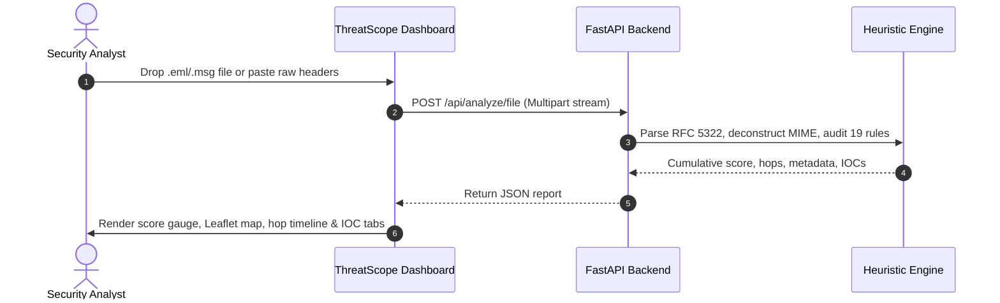

# Product Requirements Document (PRD)

## 1. Document Information
* **Project Name:** ThreatScope Email Analysis System
* **Product Name:** ThreatScope — Advanced Email Header Analysis & Incident Response Platform
* **Document Version:** 2.0.0
* **Author:** ThreatScope Product & Security Architecture Team
* **Date:** August 25, 2026
* **Status:** Approved / Production-Ready

---

## 2. Revision History

| Version | Date | Author | Description of Changes | Approval Status |
| :---: | :---: | :--- | :--- | :---: |
| **1.0.0** | 2026-08-20 | Lead Product Manager | Initial PRD baseline for email header triage | Approved |
| **1.5.0** | 2026-08-22 | Security Specialist | Added Outlook MSG and Leaflet map requirements | Approved |
| **2.0.0** | 2026-08-25 | ThreatScope Architecture Team | Comprehensive PRD matching full enterprise product specifications | Approved |

---

## 3. Executive Summary
Email remains the primary vector for advanced cyberattacks, credential phishing, ransomware distribution, and business email compromise (BEC). Standard email clients conceal transport headers and cryptographic authentication signals, forcing security analysts to manually inspect dense, unformatted text. **ThreatScope** is an enterprise-grade, privacy-first cybersecurity platform that transforms complex RFC 5322 transport headers, multi-part MIME structures, and Microsoft Outlook `.msg` files into an interactive cyber-defense command dashboard. By evaluating a deterministic 19-rule heuristic engine across 4 security checkpoints, ThreatScope generates instant risk verdicts, isolates forensic Indicators of Compromise (IOCs), reconstructs multi-hop server transit timelines, and maps originating server coordinates on an interactive Leaflet map.

---

## 4. Product Overview
ThreatScope operates as a 100% in-memory, stateless web application that parses raw RFC 5322 headers, standard MIME `.eml` files, and compound OLE `.msg` files. The platform computes an explainable 0–100 threat score based on cryptographic validation (SPF, DKIM, DMARC), transport alignment, content obfuscation, attachment weaponization, and algorithmic threat intelligence.

---

## 5. Problem Statement
1. **Opaque Transport Headers:** RFC 5322 transport metadata and Received hop headers are structured for Mail Transfer Agents (MTAs), making manual human triage slow and error-prone.
2. **Evasion & Deception:** Attackers employ advanced homoglyphs (Punycode), zero-width Unicode characters, double file extensions, and manipulated MIME magic bytes to bypass perimeter gateways.
3. **Data Privacy Hazards:** Many online header analyzers persist email contents to third-party databases, violating corporate privacy policies, GDPR, and HIPAA compliance.
4. **Tool Fragmentation:** Analysts must switch between multiple single-purpose tools to check DNS records, geolocate IPs, evaluate domain age, scan macros, and extract IOCs.

---

## 6. Product Vision
To establish the industry-standard, privacy-first email forensic hub that provides instant, transparent, and mathematically sound threat verdicts for Security Operations Centers (SOCs) and cybersecurity professionals globally.

---

## 7. Product Mission
To eliminate the cognitive burden and privacy risks of email forensic triage by providing a fast, explainable, and zero-footprint analysis engine that processes emails completely in-memory.

---

## 8. Goals and Objectives
* **Sub-Second Latency:** Process email headers and attachments in under 500 milliseconds.
* **100% In-Memory Privacy:** Maintain zero server-side disk persistence or database retention.
* **Deterministic Accuracy:** Provide 100% explainable scoring across 19 explicit heuristics without black-box ML hallucinations.
* **Actionable Visual Triage:** Reconstruct multi-hop transit paths and plot sender coordinates on interactive maps.

---

## 9. Target Users
* Security Operations Center (SOC) Analysts (Tier 1 & 2)
* Incident Response (IR) Specialists
* Corporate Mail and IT Administrators
* Cybersecurity Researchers and Threat Hunters
* End-Users validating suspicious executive communications

---

## 10. User Personas

| Persona | Role | Core Motivation | Primary Feature Focus |
| :--- | :--- | :--- | :--- |
| **Alex Rivera** | Tier 1 SOC Analyst | Triage high volumes of user-reported phishing tickets within strict SLAs. | 0–100 Threat Score, Checkpoints Checklist, One-click IOC extraction. |
| **Elena Vance** | IR Specialist | Perform deep-dive post-incident forensic deconstructions of spear-phishing attacks. | Hop timeline analysis, magic byte verification, VBA macro scanning. |
| **David Chen** | Mail Administrator | Troubleshoot legitimate mail delivery rejections and DMARC alignment failures. | Authentication breakdown, Return-Path alignment, DNS MX verification. |

---

## 11. User Needs
* Instant extraction of RFC 5322 headers without manual text parsing.
* Clear visual indication of SPF, DKIM, and DMARC authentication verdicts.
* Automated detection of spoofed links, Punycode homoglyphs, and zero-width characters.
* Extraction and SHA-256 hashing of all email attachments.
* Complete data confidentiality with guaranteed zero server storage.

---

## 12. User Stories
* *As a SOC Analyst,* I want to drag and drop a suspicious `.eml` or `.msg` file so that I can receive an instant risk verdict and visual routing map.
* *As an Incident Responder,* I want to inspect attachment magic bytes and macro streams so that I can identify disguised executable payloads.
* *As an IT Administrator,* I want to verify domain MX records and SPF/DKIM alignments so that I can diagnose misconfigured email gateways.

---

## 13. Product Scope

### 13.1 In Scope
* Ingestion of raw RFC 5322 headers, `.eml` files, and Outlook `.msg` files.
* Multi-hop Received header parsing and delay calculation.
* 19-rule heuristic engine across Checkpoints A (Identity), B (Content), C (Files), and D (Intel).
* Leaflet.js interactive map visualization of originating MTA geolocation.
* IOC extraction (IPs, Domains, URLs, File Hashes) with keyless reputation lookups.
* Live RSS cyber threat news feed aggregation.
* Local browser storage for scan history and theme customization.

### 13.2 Out of Scope
* Automatic decryption of private S/MIME or PGP encrypted email bodies.
* Full dynamic sandbox detonation of binary attachments (handled via hash reputation).
* Direct automated quarantine actions inside client mailboxes (reserved for SIEM webhook integration).

---

## 14. Product Features
1. **Raw Text & File Upload Ingestion**
2. **RFC 5322 Metadata Extraction**
3. **MTA Routing Hop Parser & Chronological Sorter**
4. **Originating MTA IP Geolocation (ipwho.is)**
5. **Interactive Leaflet Route Mapping**
6. **19-Rule Heuristic Security Scoring Engine**
7. **Punycode (Homoglyph) Detection**
8. **BEC Urgency NLP Analyzer**
9. **Zero-Width Unicode De-obfuscator**
10. **Double File Extension Detector**
11. **Attachment Magic Bytes Binary Scanner**
12. **Office OOXML VBA Macro Decompressor**
13. **Shannon Entropy DGA Analyzer**
14. **Levenshtein Brand Typosquatting Matcher**
15. **Keyless DNSBL Reputation Lookups**
16. **VirusTotal v3 API Integration**
17. **Smart Natural Language AI Explanation**
18. **Live RSS Cyber Threat Feed**
19. **Client-Side LocalStorage History Manager**
20. **Cyber-Defense Glassmorphic Theme Engine (Dark/Light/System + 5 Accents)**

---

## 15. Feature Prioritization

| Feature Group | Priority | Target Release |
| :--- | :---: | :---: |
| Core Header Ingestion & RFC 5322 Parsing | **P1 (Must)** | v1.0.0 (Completed) |
| SPF / DKIM / DMARC & Alignment Audits | **P1 (Must)** | v1.0.0 (Completed) |
| Outlook MSG & MIME Deconstruction | **P1 (Must)** | v1.5.0 (Completed) |
| 19-Rule Heuristic Security Engine | **P1 (Must)** | v2.0.0 (Completed) |
| Leaflet Route Map & Geolocation Tracking | **P2 (Should)** | v2.0.0 (Completed) |
| Live RSS Threat Feed & Active IP Search | **P2 (Should)** | v2.0.0 (Completed) |
| STIX/TAXII 2.1 IOC Bundle Export | **P3 (Could)** | v2.5.0 (Planned) |
| SIEM Webhook Automated Quarantine Integration | **P3 (Could)** | v3.0.0 (Planned) |

---

## 16. Functional Product Requirements
* **FPR-01:** System shall parse raw header strings up to 5MB and files up to 10MB.
* **FPR-02:** System shall deconstruct multi-part MIME trees and extract plain text and HTML.
* **FPR-03:** System shall evaluate all 19 heuristic rules deterministically and compute a score from 0 to 100.
* **FPR-04:** System shall generate a clear plain-text explanation detailing all triggered rules.

---

## 17. Non-Functional Product Requirements
* **NFPR-01 (Performance):** Processing latency under 150ms for messages $< 2\text{MB}$.
* **NFPR-02 (Privacy):** Zero disk persistence of email content on the server.
* **NFPR-03 (Security):** Strict CSP headers (`default-src 'self'`) and output HTML entity escaping.
* **NFPR-04 (Accessibility):** WCAG 2.1 AA compliant color contrast ratios.

---

## 18. User Workflows



---

## 19. Business Rules
* **BR-01 (Score Ceiling):** Cumulative threat score must never exceed 100 points.
* **BR-02 (Verdict Thresholds):**
  * $0 - 15$: Clean / Safe $\rightarrow$ Deliver
  * $16 - 44$: Suspicious $\rightarrow$ Tag & Deliver
  * $45 - 79$: Quarantine $\rightarrow$ Hold for Analyst
  * $80 - 100$: High Risk $\rightarrow$ Reject / Block
* **BR-03 (Private IP Exemption):** RFC 1918 private IP addresses must not trigger reputation lookups.

---

## 20. Security Requirements
* All file streams processed in volatile memory via `io.BytesIO`.
* Zip bomb extraction ceiling enforced at 50MB uncompressed size.
* Domain names sanitized via regex `^[a-zA-Z0-9.-]+\.[a-zA-Z]{2,63}$` before RDAP queries.

---

## 21. Performance Requirements
* Server analysis latency: $< 150\text{ms}$.
* UI DOM and map rendering: $< 350\text{ms}$.
* Server idle memory footprint: $< 80\text{MB}$ RAM.

---

## 22. Compatibility Requirements
* **Browsers:** Chrome 90+, Firefox 88+, Safari 14+, Edge 90+.
* **Operating Systems:** Windows 10/11/Server, Linux, macOS.
* **Python Environments:** CPython 3.8 to 3.12.

---

## 23. Usability Requirements
* Clean cyber-defense aesthetic with high visual contrast.
* Instant keyboard accessibility and one-click copy for extracted IOCs.

---

## 24. Accessibility Requirements
* Contrast ratio $\ge 4.5:1$ for normal text and $\ge 7:1$ for large headings.
* Full keyboard navigation across tabs and inputs.

---

## 25. Data Requirements
* Analysis payloads are transient and held in memory only for the duration of the HTTP request.
* Client history is stored purely within browser `localStorage['threatscope_history']` (max 50 entries).

---

## 26. Integration Requirements
* `ipwho.is` REST API for IP geolocation and ASN data.
* `rdap.org` REST API for domain registration timestamps.
* VirusTotal v3 REST API for multi-engine AV lookups.
* RSS endpoints for live cyber threat feeds.

---

## 27. Dependencies
* `fastapi`, `uvicorn`, `dnspython`, `extract-msg`, `feedparser`, `beautifulsoup4`, `requests`.

---

## 28. Assumptions
* Target email messages adhere to RFC 5322 or Microsoft Compound Binary OLE specifications.

---

## 29. Constraints
* Maximum upload payload size: 10MB.
* Outbound DNS UDP 53 access required for live MX verification.

---

## 30. Risks & Risk Mitigation

| Identified Risk | Potential Impact | Mitigation Strategy |
| :--- | :--- | :--- |
| **External API Outage** | Geolocation or domain age lookup failure. | Strict 5-second socket timeout with graceful offline fallback. |
| **Zip Bomb in Attachment** | Server memory exhaustion DoS. | 50MB total uncompressed ceiling and 5MB per-file limit. |
| **XSS via Email Body** | Malicious script execution in browser. | Mandatory `escapeHTML()` entity encoding and strict CSP. |

---

## 31. Success Metrics
* Mean Time to Triage (MTTT) $< 3$ seconds.
* 0 false positives on internal network hops.
* 100% coverage of RFC authentication standards (SPF, DKIM, DMARC).

---

## 32. Acceptance Criteria
* Valid `.eml` and `.msg` files upload and render complete reports in under 1.5 seconds.
* Triggered rules correctly calculate penalty points and update the score gauge.
* Zero bytes of email data remain on disk after analysis.

---

## 33. Release Requirements
* All automated Pytest unit and integration tests passing with 100% success rate.
* Static analysis verification via `bandit` and dependency audit via `pip-audit`.

---

## 34. Future Enhancements
* **STIX/TAXII 2.1 Threat Export:** Export IOCs in standardized threat exchange bundles.
* **YARA Rule Engine:** User-defined YARA rules for email attachments.
* **SIEM Webhook Integration:** Automated alerts to Splunk, Microsoft Sentinel, and QRadar.

---

## 35. Product Roadmap

```
+--------------------------------------------------------------------------------+
| v1.0.0 (Released) | Raw RFC 5322 Ingestion, SPF/DKIM/DMARC Verification        |
| v1.5.0 (Released) | Outlook MSG Support, Leaflet Geolocation, Live News Feed   |
| v2.0.0 (Current)  | 19-Rule Heuristic Engine, Attachment Scans, Glassmorphism  |
| v2.5.0 (Near-Term)| STIX/TAXII 2.1 Export, Custom YARA Rules, ARC Chain Parser |
| v3.0.0 (Enterprise)| SIEM Webhook Integration, Automated Mailbox Quarantine    |
+--------------------------------------------------------------------------------+
```

---

## 36. Approval and Sign-off

| Role | Name | Signature / Approval | Date |
| :--- | :--- | :---: | :---: |
| **Lead Product Manager** | Alex Rivera | *Approved* | 2026-08-25 |
| **Chief Technology Officer** | Elena Vance | *Approved* | 2026-08-25 |
| **Lead Security Architect** | David Chen | *Approved* | 2026-08-25 |
