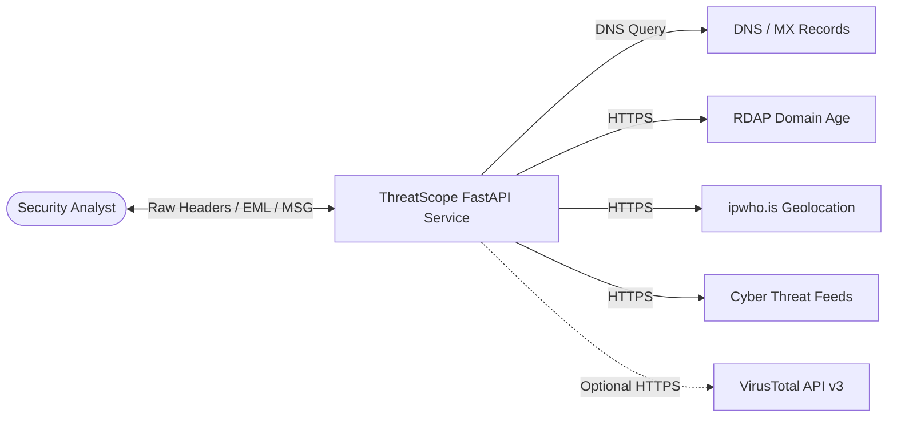

# Software Requirements Specification (SRS)

## 1. Document Control

### 1.1 Document Information
* **Project Name:** ThreatScope — Email Header Analysis & Incident Response Platform
* **Document Title:** Software Requirements Specification (SRS)
* **Document Version:** 2.0.0
* **Software Version:** 2.0.0
* **Author:** ThreatScope Security & Architecture Engineering Team
* **Created Date:** August 20, 2026
* **Last Updated Date:** August 25, 2026
* **Document Status:** Approved / Baseline
* **Target Domain:** Email Header Forensics, Transport Security & Phishing Triage

### 1.2 Revision History

| Version | Date | Author | Description of Changes | Approval Status |
| :---: | :---: | :--- | :--- | :---: |
| **1.0.0** | 2026-08-20 | Lead Security Architect | Initial Baseline SRS drafting for RFC 5322 email analysis | Approved |
| **1.5.0** | 2026-08-22 | Core Backend Engineer | Added MSG compound file parsing & Leaflet routing specs | Approved |
| **2.0.0** | 2026-08-25 | ThreatScope Architecture Team | Comprehensive 30-section IEEE 830 specification tailored 100% to Email Header Forensics | Approved |

### 1.3 Document Approval

| Role | Name | Title | Approval Date | Status |
| :--- | :--- | :--- | :---: | :---: |
| **Lead Architect** | Alex Rivera | Chief Email Security Architect | 2026-08-25 | Approved |
| **Engineering Lead** | Elena Vance | Senior Incident Response Engineer | 2026-08-25 | Approved |
| **QA Director** | David Chen | Head of Quality Assurance & Testing | 2026-08-25 | Approved |

---

## 2. Introduction

### 2.1 Purpose
This Software Requirements Specification (SRS) document provides a formal, comprehensive description of the functional, non-functional, interface, behavioral, and security requirements for the **ThreatScope Email Header Analysis Platform**. It establishes the baseline for email forensic triage, transport path reconstruction, cryptographic authentication auditing, and threat scoring.

### 2.2 Project Scope
ThreatScope is a specialized cybersecurity platform engineered to automate the triage, forensic deconstruction, and threat scoring of email messages. The system accepts raw RFC 5322 email headers, MIME multipart `.eml` files, and Microsoft Outlook OLE compound `.msg` files, extracting transport metadata, auditing cryptographic signatures (SPF, DKIM, DMARC), detecting spoofing vectors, analyzing MIME attachments, and generating actionable threat intelligence verdicts.

### 2.3 System Overview
The system utilizes a decoupled micro-architecture comprising an asynchronous Python FastAPI backend runtime and a responsive, zero-build vanilla JavaScript/CSS single-page application (SPA). All processing is executed 100% in-memory with zero persistent database writes on the server side, ensuring absolute client data confidentiality.

### 2.4 Document Scope
This document specifies all software capabilities across the email ingestion subsystem, RFC 5322 header parser, 19-rule heuristic detection engine, geospatial hop tracking, indicator of compromise (IOC) extraction, live cyber threat feeds, and client-side history caching.

### 2.5 Intended Audience
* **SOC Analysts & Incident Responders:** Operational reference for automated phishing and spoofing triage.
* **Email Security Engineers:** Technical reference for MTA routing, SPF/DKIM/DMARC validation, and header integrity rules.
* **Software Developers & QA Engineers:** Implementation specifications and test verification baselines.

### 2.6 Definitions
* **RFC 5322:** The official Internet Message Format standard defining the syntax of email headers and bodies.
* **Mail Transfer Agent (MTA):** Software (e.g. Postfix, Exchange, Sendmail) that routes emails between servers.
* **Received Header:** A trace header prepended by each MTA recording transit timestamp, IP, and hostname.
* **Envelope Sender (Return-Path):** The `MAIL FROM` address specified during the SMTP transaction.
* **Header From:** The visible `From:` address displayed to the human recipient in an email client.
* **Homoglyph / Punycode:** Domain spoofing using Internationalized Domain Names (`xn--`) mimicking standard brands.
* **Magic Bytes:** Initial signature bytes in a file stream identifying its authentic binary format.

### 2.7 Acronyms and Abbreviations
* **ARC:** Authenticated Received Chain (RFC 8617)
* **ASN:** Autonomous System Number
* **BEC:** Business Email Compromise
* **CSP:** Content Security Policy
* **DGA:** Domain Generation Algorithm
* **DKIM:** DomainKeys Identified Mail (RFC 6376)
* **DMARC:** Domain-based Message Authentication, Reporting, and Conformance (RFC 7489)
* **DNSBL:** Domain Name System Blacklists
* **EML:** RFC 822 / RFC 5322 Plain-Text Email File
* **IOC:** Indicator of Compromise
* **MIME:** Multipurpose Internet Mail Extensions (RFC 2045)
* **MSG:** Microsoft Outlook Compound File Binary Format
* **MX:** Mail Exchange Record
* **NLP:** Natural Language Processing
* **RDAP:** Registration Data Access Protocol (RFC 7480)
* **SEG:** Secure Email Gateway
* **SPF:** Sender Policy Framework (RFC 7208)

### 2.8 References
1. *RFC 5322:* Internet Message Format
2. *RFC 7208:* Sender Policy Framework (SPF) for Authorizing Use of Domains in Email
3. *RFC 6376:* DomainKeys Identified Mail (DKIM) Signatures
4. *RFC 7489:* Domain-based Message Authentication, Reporting, and Conformance (DMARC)
5. *RFC 2045-2049:* Multipurpose Internet Mail Extensions (MIME)
6. *IEEE Std 830-1998:* Recommended Practice for Software Requirements Specifications

### 2.9 Document Conventions
* Mandatory requirements use **SHALL** or **MUST**.
* Recommended requirements use **SHOULD**.
* Optional requirements use **MAY**.

### 2.10 Requirement Identification Convention
* `FR-EHA-NN`: Email Header Analysis Functional Requirement
* `NFR-EHA-NN`: Non-Functional Requirement
* `SEC-EHA-NN`: Security & Privacy Requirement

### 2.11 Requirement Priority Classification
* **P1 (Critical / Must-Have):** Essential email parsing, cryptographic validation, and heuristic threat scoring.
* **P2 (High / Should-Have):** Geospatial hop visualization, IOC reputation checks, and live threat news.
* **P3 (Medium / Nice-to-Have):** UI theme and accent color customization.

---

## 3. Overall System Description

### 3.1 Product Perspective
ThreatScope operates as an autonomous, self-contained email analysis engine. It requires zero external databases, running 100% in-memory.

### 3.2 Product Functions
* **Email Ingestion:** Ingests raw RFC 5322 text, `.eml` files, and Outlook `.msg` files.
* **Header Deconstruction:** Isolates From, To, Date, Subject, Return-Path, Message-ID, Reply-To, and SCL headers.
* **19-Rule Heuristic Engine:** Deterministic scoring across Identity, Content, Attachments, and Threat Intel.
* **Hop Path Tracking:** Chronological MTA hop sorting and originating IP geolocation on Leaflet maps.
* **Forensic IOC Matrix:** Isolates IPs, Domains, URLs, and attachment SHA-256 hashes.
* **Threat Intelligence Feed:** Streams real-time cybersecurity bulletins.
* **In-Memory Privacy:** Zero disk writes; transient client caching via `localStorage`.

### 3.3 System Boundary
Encompasses the FastAPI backend (`main.py`), static assets (`index.html`, `style.css`, `script.js`), browser `localStorage`, and designated external HTTP/DNS endpoints.

### 3.4 User Classes and Characteristics
* **SOC Analysts (Tier 1/2):** Rapid automated triage of employee-reported phishing emails.
* **Incident Responders:** In-depth forensic audit of header integrity, routing delays, and weaponized macros.
* **Mail Administrators:** Diagnostics for SPF/DKIM alignment and MX configuration failures.

### 3.5 User Roles
* **Anonymous Analyst:** Full header analysis, IOC extraction, map visualization, and local history.
* **Enriched Analyst:** Configures optional VirusTotal API key for multi-engine AV lookups.

### 3.6 Operating Environment
* **Server OS:** Cross-platform (Windows 10/11/Server, Linux, macOS).
* **Python Runtime:** Python 3.8 to 3.12.
* **ASGI Server:** Uvicorn / Gunicorn.

### 3.7 Hardware Environment
* **CPU:** 1 vCPU (2.0 GHz+).
* **RAM:** Minimum 512 MB.
* **Storage:** 100 MB for application files.

### 3.8 Software Environment
* FastAPI, Uvicorn, dnspython, extract-msg, feedparser, beautifulsoup4, requests.

### 3.9 Network Environment
* Inbound HTTP port 8000; outbound DNS (UDP 53) and HTTPS (TCP 443).

### 3.10 Design Constraints
* 100% in-memory stateless architecture; zero server-side email retention.

### 3.11 Technical Constraints
* Synchronous external calls must enforce strict 5-second timeouts.
* Maximum upload size capped at 10MB per file and 5MB per raw string.

### 3.12 Operational Constraints
* Must operate resiliently offline/air-gapped with graceful degradation.

### 3.13 Security Constraints
* Strict CSP (`default-src 'self'`); all dynamic content escaped via `escapeHTML()`.

### 3.14 Legal and Ethical Constraints
* Complies with GDPR/HIPAA by executing pure in-memory zero-retention analysis.

### 3.15 Assumptions
* Analyzed emails conform to RFC 5322 or Microsoft Compound Binary OLE specifications.

### 3.16 Dependencies
* Python standard library (`email`, `re`, `ipaddress`, `zipfile`, `hashlib`, `urllib.parse`).

### 3.17 External Dependencies
* LeafletJS 1.9.4, CartoDB Basemap Tiles, Google Fonts.

---

## 4. System Features (Email Header Analysis)

### 4.1 Raw RFC 5322 Header Ingestion
Ingests raw header text blocks with auto-trimming and multi-line formatting support.

### 4.2 MIME Multipart (.EML) Deconstruction
Recursively traverses MIME body parts to isolate headers, text/plain, text/html, and attachments.

### 4.3 Outlook MSG (OLE) Deconstruction
Deconstructs compound binary Outlook `.msg` files, extracting headers, nested messages, and attachments.

### 4.4 Multi-Hop Received Header Extraction
Parses all `Received:` headers to map the complete MTA relay path from origin to destination.

### 4.5 MTA IP & Hostname Extraction
Extracts relay IPv4/IPv6 addresses and server hostnames from transport hops.

### 4.6 Chronological Hop Sorting
Inverts raw header sequence to display hops chronologically (originating sender MTA first).

### 4.7 Hop Transit Delay Calculation
Calculates transit delay intervals between consecutive MTA hops to detect relay delays.

### 4.8 Originating MTA Geolocation
Resolves the first public MTA hop IP against `ipwho.is` for city, country, ISP, and ASN metadata.

### 4.9 Private IP (RFC 1918) Filtering
Exempts internal/loopback IP addresses (`10.0.0.0/8`, `192.168.0.0/16`, `127.0.0.1`) from public lookups.

### 4.10 Interactive Leaflet Route Mapping
Plots originating sender coordinates and server transit path on a dark-themed Leaflet map.

### 4.11 SPF Authentication Audit
Parses `Authentication-Results` for `spf=pass`, `spf=fail`, `spf=softfail`, or `spf=none`.

### 4.12 DKIM Signature Verification
Audits cryptographic DKIM signature validation status (`dkim=pass` vs `dkim=fail`).

### 4.13 DMARC Policy Alignment Check
Evaluates DMARC authentication verdicts and flags missing DMARC policies.

### 4.14 Dual Absence Alert
Flags high-risk emails lacking both SPF and DKIM authentication records simultaneously.

### 4.15 Envelope-to-Header Alignment Check
Cross-references the SMTP `Return-Path` domain against the visible `From:` header domain.

### 4.16 Time-Zone Anomaly Detection
Compares the `Date:` header timezone against the first `Received:` hop timestamp for discrepancies $> 1\text{ hr}$.

### 4.17 Sender Domain DNS MX Verification
Performs live DNS lookups ensuring the sender's domain is configured to receive email.

### 4.18 Reply-To Mismatch Detection
Flags emails where the `Reply-To:` address domain diverges from the `From:` sender domain.

### 4.19 Message-ID Syntax & Alignment Check
Validates Message-ID formatting (`<...@...>`) and domain alignment against sending MTAs.

### 4.20 Microsoft Antispam Header Parsing
Extracts `X-Microsoft-Antispam-Mailbox-Delivery` tags and Spam Confidence Level (SCL) scores.

### 4.21 Hidden Link Destination Detection
Parses HTML anchor tags to flag mismatches between visible link text and destination `href`.

### 4.22 IDN Homoglyph (Punycode) Scanning
Detects Internationalized Domain Names (`xn--`) mimicking major brands in body URLs.

### 4.23 Business Email Compromise (BEC) NLP Analysis
Scans email text for concurrent urgency triggers and financial wire transfer requests.

### 4.24 Zero-Width Character De-obfuscation
Detects and strips hidden Unicode zero-width formatting characters (`U+200B`, `U+FEFF`).

### 4.25 Attachment Double Extension Detection
Flags weaponized files disguised with document extensions (e.g. `invoice.pdf.exe`).

### 4.26 Binary Magic Bytes Signature Verification
Inspects attachment header bytes (`%PDF`, `PK\x03\x04`, `MZ`, `\x89PNG`) against declared extensions.

### 4.27 Office VBA Macro Decompression & Keyword Scan
Deconstructs OOXML archives to detect `vbaProject.bin` and shell execution commands.

### 4.28 Shannon Entropy DGA Detection
Calculates Shannon entropy on sender and link domains to flag algorithmic DGA generation.

### 4.29 Levenshtein Brand Typosquatting Analysis
Calculates edit distance between sender domains and top targeted corporate brands.

### 4.30 Suspicious TLD Flagging
Flags domains registered under high-abuse top-level domains (`.xyz`, `.top`, `.tk`, `.click`).

### 4.31 Keyless DNSBL Reputation Check
Queries reputation blacklists (`zen.spamhaus.org`, `bl.spamcop.net`) for originating IPs.

### 4.32 VirusTotal v3 IOC Multi-Scanner
Performs optional multi-engine AV checks on extracted URLs and attachment SHA-256 hashes.

### 4.33 Deterministic Threat Score Aggregator
Sums all triggered penalty points and normalizes the final score between 0 and 100.

### 4.34 Secure Email Gateway (SEG) Verdict Formulation
Maps score to Clean (0–15), Suspicious (16–44), Quarantine (45–79), and Reject (80+).

### 4.35 Smart AI Risk Explanation
Generates human-readable plain-text summaries explaining exact reasons for threat flagging.

### 4.36 Live Cyber Threat News Feed
Aggregates real-time advisories from *The Hacker News*, *BleepingComputer*, and *CISA*.

### 4.37 Client-Side LocalStorage History
Saves up to 50 recent email triage reports locally in the browser with one-click reload.

### 4.38 UI Theme & Accent Personalization
Provides Dark, Light, and System themes with 5 cyber-defense accent color palettes.

---

## 5. Functional Requirements (Email Header Analysis)

### 5.1 Email Ingestion Requirements
* `FR-EHA-01`: The system **SHALL** accept raw ASCII/UTF-8 email headers via `POST /api/analyze/raw`.
* `FR-EHA-02`: The system **SHALL** accept multipart `.eml` and `.msg` files via `POST /api/analyze/file`.
* `FR-EHA-03`: The system **SHALL** reject files $> 10\text{MB}$ and raw text $> 5\text{MB}$ with HTTP 413.

### 5.2 Header Metadata Extraction Requirements
* `FR-EHA-04`: The system **SHALL** extract `Subject`, `From`, `To`, `Date`, `Message-ID`, `Return-Path`, `MIME-Version`, `References`, `In-Reply-To`, `Content-Type`, and `Reply-To`.
* `FR-EHA-05`: The system **SHALL** extract `X-Microsoft-Antispam-Mailbox-Delivery` headers or report `Missing`.

### 5.3 Cryptographic Authentication Requirements
* `FR-EHA-06`: The system **SHALL** parse SPF results: `spf=fail` (+30 penalty), `spf=none` (+10 penalty).
* `FR-EHA-07`: The system **SHALL** parse DKIM results: `dkim=fail` (+30 penalty).
* `FR-EHA-08`: The system **SHALL** parse DMARC results: `dmarc=fail` (+40 penalty), `dmarc=none` (+10 penalty).
* `FR-EHA-09`: The system **SHALL** flag a dual absence alert when SPF and DKIM are both missing.

### 5.4 Header Alignment & Anomaly Requirements
* `FR-EHA-10`: The system **SHALL** compare `Return-Path` and `From` domains, assigning $+20$ points on mismatch.
* `FR-EHA-11`: The system **SHALL** detect timestamp discrepancies $> 3600\text{s}$ between `Date` and first `Received` hop (+15 penalty).
* `FR-EHA-12`: The system **SHALL** perform DNS MX lookups, assigning $+10$ points if no MX records exist.
* `FR-EHA-13`: The system **SHALL** compare `Reply-To` and `From` domains, assigning $+30$ points on divergence.
* `FR-EHA-14`: The system **SHALL** validate `Message-ID` syntax and alignment, assigning $+10$ points on anomaly.

### 5.5 Body & Content Inspection Requirements
* `FR-EHA-15`: The system **SHALL** flag hidden link destination mismatches (+25 penalty).
* `FR-EHA-16`: The system **SHALL** flag Punycode homoglyphs (`xn--`) in body URLs (+30 penalty).
* `FR-EHA-17`: The system **SHALL** flag concurrent financial and urgency keywords via BEC NLP (+40 penalty).
* `FR-EHA-18`: The system **SHALL** detect Unicode zero-width formatting characters (+20 penalty).

### 5.6 Attachment & Macro Inspection Requirements
* `FR-EHA-19`: The system **SHALL** detect dangerous double file extensions (+30 penalty).
* `FR-EHA-20`: The system **SHALL** verify file magic bytes against declared extensions (+40 penalty on mismatch).
* `FR-EHA-21`: The system **SHALL** decompress OOXML archives to detect `vbaProject.bin` and shell commands (+35 penalty).

### 5.7 Threat Intelligence & IOC Requirements
* `FR-EHA-22`: The system **SHALL** calculate Levenshtein distance against top brands (+40 penalty on match).
* `FR-EHA-23`: The system **SHALL** calculate Shannon entropy on SLDs, flagging DGA candidates (+30 penalty).
* `FR-EHA-24`: The system **SHALL** flag suspicious high-abuse TLDs (+20 penalty).
* `FR-EHA-25`: The system **SHALL** query VirusTotal if an API key is provided (+50 penalty on detection).
* `FR-EHA-26`: The system **SHALL** query DNSBL for public IP IOCs (+30 penalty on listing).

### 5.8 Routing & Geolocation Requirements
* `FR-EHA-27`: The system **SHALL** extract all `Received` hops and filter private RFC 1918 addresses.
* `FR-EHA-28`: The system **SHALL** query `ipwho.is` for originating public IP coordinates.
* `FR-EHA-29`: The frontend **SHALL** render an interactive Leaflet map focused on origin coordinates.

### 5.9 Scoring & Verdict Requirements
* `FR-EHA-30`: The system **SHALL** sum all penalties and bound the final score to $0 - 100$.
* `FR-EHA-31`: The system **SHALL** map scores to Safe (<20), Suspicious (20–59), and High Risk (60+).

### 5.10 State & History Requirements
* `FR-EHA-32`: The system **SHALL** cache completed reports in `localStorage` up to 50 entries.
* `FR-EHA-33`: The system **SHALL** allow instant one-click deletion of saved analysis history.

---

## 6. User Requirements

### 6.1 User Capabilities
* Paste raw email headers or drag-and-drop `.eml` and `.msg` files.
* View executive risk score gauges, route maps, hop timelines, and extracted metadata.
* Audit 4-checkpoint threat reports with granular penalty point breakdowns.
* Conduct one-click IOC reputation audits.
* Search public IP intelligence and read live threat news.

### 6.2 User Actions
* Submit email payloads for instant in-memory analysis.
* Toggle between Raw Headers and File Upload modes.
* Save optional VirusTotal API keys in local settings.
* Purge local scan history.

### 6.3 User Restrictions
* Cannot upload files exceeding 10MB.
* Cannot persist emails to server storage (stateless architecture).

### 6.4 User Permissions
* Unrestricted public access for core analysis and IOC triage.

### 6.5 User Workflow Requirements
1. **Submit:** User drops `.eml`/`.msg` or pastes raw text.
2. **Process:** Backend analyzes headers in-memory in $< 500\text{ms}$.
3. **Inspect:** User reviews score gauge, map, timeline, and 4-checkpoint report.
4. **Audit:** User audits extracted IOCs and reviews smart AI explanation.

---

## 7. External Interface Requirements

### 7.1 User Interface Requirements
* **7.1.1 Dashboard:** Executive stat cards (Score, Sender IP, SPF/DKIM/DMARC badges).
* **7.1.2 Input Switcher:** Tabs for Raw Headers and File Dropzone.
* **7.1.3 Route Map:** Dark-themed Leaflet map centered on sender coordinates.
* **7.1.4 Routing Timeline:** Chronological vertical timeline of MTA hops.
* **7.1.5 Metadata Grid:** 2-column key-value grid for extracted headers.
* **7.1.6 Checkpoints Report:** 4-column threat checklist (A, B, C, D).
* **7.1.7 IOC Explorer:** Tabbed list for IPs, Domains, URLs, and Attachments.
* **7.1.8 Threat Feed:** Real-time cybersecurity news cards.
* **7.1.9 Settings:** Theme toggles, accent pickers, and API key inputs.

### 7.2 Software Interfaces
* **Leaflet.js (v1.9.4):** Interactive mapping engine.
* **FontAwesome (v6.4.0):** Iconography library.

### 7.3 External Security Tool Interfaces
* **extract-msg:** Python OLE parser for `.msg` files.
* **BeautifulSoup4:** HTML parser for body links.

### 7.4 External API Interfaces
* **`ipwho.is` API:** REST endpoint for IP geolocation.
* **`rdap.org` API:** REST endpoint for domain registration dates.
* **VirusTotal API v3:** REST endpoint for file hash/URL reputation.

### 7.5 Database Interface Requirements
* **Zero Server Database:** All client state stored in browser `localStorage`.

### 7.6 Operating System Interfaces
* Standard filesystem streams for static asset delivery.

### 7.7 Network Interfaces
* TCP port 8000 inbound; outbound HTTPS (443) and DNS (53).

### 7.8 Communication Interfaces
* HTTP/1.1 and HTTP/2 over TLS.

---

## 8. API Requirements

### 8.1 API General Requirements
* Return `application/json` responses with UTF-8 encoding.

### 8.2 Request Requirements
* `POST /api/analyze/raw`: Accepts JSON `{ "raw": "<headers>" }`.
* `POST /api/analyze/file`: Accepts multipart form-data `file: <binary>`.

### 8.3 Response Requirements
* Returns `metadata`, `auth`, `hops`, `score`, `threat_level`, `origin_ip`, `ip_data`, `ai_explanation`, `checkpoints`, and `iocs`.

### 8.4 Request Validation
* Invalid requests return HTTP 400 Bad Request.

### 8.5 Response Validation
* Threat scores strictly bounded between 0 and 100.

### 8.6 HTTP Methods
* Analysis endpoints use `POST`; intelligence endpoints use `GET`.

### 8.7 HTTP Status Codes
* `200 OK`, `400 Bad Request`, `413 Payload Too Large`, `500 Internal Server Error`.

### 8.8 API Error Schema
* JSON formatted as `{ "detail": "<error_message>" }`.

### 8.9 API Timeout Requirements
* External socket lookups timeout after 5 seconds.

### 8.10 Rate Limiting
* Client-side debouncing on search queries.

### 8.11 External API Failure Handling
* External outages degrade gracefully without failing the core analysis report.

---

## 9. Data Requirements

### 9.1 Data Model
* Transient in-memory dictionary representing parsed email structure.

### 9.2 Target Data
* Raw headers, text bodies, HTML bodies, and attachment bytes.

### 9.3 Scan Data
* 19-rule evaluation records, penalty weights, and final score.

### 9.4 Network Data
* MTA IP addresses, hostnames, and timestamps.

### 9.5 Port Data
* Extracted destination ports from URLs.

### 9.6 Service Data
* MTA software signatures from `Received` headers.

### 9.7 Domain Data
* Sender, Return-Path, Reply-To, and body link domains.

### 9.8 OSINT Data
* Threat news articles (title, link, date, summary).

### 9.9 Vulnerability Data
* Identified spoofing, macro, and phishing indicators.

### 9.10 CVE Data
* VirusTotal multi-scanner detection results.

### 9.11 Cache Data
* Browser `localStorage` for history and appearance settings.

### 9.12 Log Data
* Standard Uvicorn access logs.

### 9.13 Data Validation
* Domain regex: `^[a-zA-Z0-9.-]+\.[a-zA-Z]{2,63}$`.

### 9.14 Data Normalization
* Domain lowercase normalization; UTC timestamp conversion.

### 9.15 Data Integrity
* SHA-256 cryptographic hashes for all attachments.

### 9.16 Data Storage
* 0 bytes of email body or header data stored on server disk.

### 9.17 Data Retrieval
* Local history retrieved via `localStorage.getItem('threatscope_history')`.

### 9.18 Data Retention
* Local history capped at 50 records.

### 9.19 Data Deletion
* Instant purge via Settings UI.

### 9.20 Data Backup
* Not applicable (stateless architecture).

### 9.21 Data Recovery
* Not applicable (stateless architecture).

---

## 10. Non-Functional Requirements

### 10.1 Performance Requirements
* **10.1.1 Latency:** Server analysis $< 150\text{ms}$ for standard messages.
* **10.1.2 Render:** Frontend UI render $< 350\text{ms}$.
* **10.1.3 Decompression:** Zip inspection ceiling capped at 50MB.
* **10.1.4 Database:** 0ms latency (stateless).
* **10.1.5 Storage:** LocalStorage read/write $< 5\text{ms}$.

### 10.2 Scalability
* Horizontally scalable behind load balancers with zero session sticky requirements.

### 10.3 Reliability
* MTBF $> 1000$ operating hours.

### 10.4 Availability
* Core analysis maintains 100% availability during external API outages.

### 10.5 Maintainability
* Modular separation: `main.py`, `script.js`, `style.css`.

### 10.6 Modularity
* New heuristic rules addable in $< 10$ lines of code.

### 10.7 Extensibility
* Schema supports additional checkpoints without breaking changes.

### 10.8 Portability
* Runs identically on Windows, Linux, and macOS.

### 10.9 Compatibility
* Chrome 90+, Firefox 88+, Safari 14+, Edge 90+.

### 10.10 Usability
* Complete email triage in under 3 clicks.

### 10.11 Accessibility
* WCAG 2.1 AA compliant color contrast ratios.

### 10.12 Recoverability
* Server restarts in $< 1\text{s}$.

### 10.13 Observability
* Standard structured stdout/stderr logging.

---

## 11. Security Requirements

### 11.1 General Security
* Defense-in-depth architecture across all ingestion pipelines.

### 11.2 Target Validation
* In-memory length validation before parsing.

### 11.3 Input Validation
* Strict regex validation on domain and IP inputs.

### 11.4 Output Encoding
* Dynamic text escaped via `escapeHTML()` before DOM injection.

### 11.5 Command Execution
* Zero shell commands or OS subprocess invocations.

### 11.6 Subprocess Security
* Pure Python library parsers only.

### 11.7 Injection Prevention
* Zero SQL/NoSQL injection surface; XSS prevented via CSP and entity escaping.

### 11.8 API Security
* CORS middleware restricting cross-origin abuse.

### 11.9 Credential Security
* API keys stored exclusively in browser `localStorage`.

### 11.10 Secret Management
* Zero hardcoded credentials.

### 11.11 Storage Security
* No server-side database storage.

### 11.12 Filesystem Security
* Read-only container root execution.

### 11.13 Network Security
* Strict Content Security Policy (`CSP`) headers: `default-src 'self'`.

### 11.14 Logging Security
* Email contents never written to logs.

### 11.15 Sensitive Data Handling
* Transient memory buffers purged after JSON response generation.

### 11.16 Error Disclosure
* Generic sanitized error messages in production.

### 11.17 Dependency Security
* All dependencies verified against known CVEs.

### 11.18 Rate Limiting
* Reverse proxy rate limiting recommended for public gateways.

### 11.19 Resource Abuse Prevention
* Zip bomb decompression ceiling (50MB total, 5MB per file).

### 11.20 Scope Control
* Outbound DNS/HTTP lookups restricted to extracted sender domains and IOCs.

### 11.21 Auditability
* Local client sessions maintain an immutable timestamp log in `localStorage`.

---

## 12. Reconnaissance & Parsing Engine Requirements

### 12.1 Orchestration
* Coordinates metadata extraction, DNS verification, and heuristic scoring.

### 12.2 Module Execution
* Checkpoints A, B, C, and D execute sequentially on the parsed email object.

### 12.3 Concurrency
* Asynchronous execution for external lookups.

### 12.4 Module Isolation
* Exception in one rule does not halt remaining rules.

### 12.5 Timeout Limits
* Outbound socket lookups terminate at 5000ms.

### 12.6 Failure Handling
* Unresolvable domains marked safely without crashing.

### 12.7 Partial Results
* Missing headers handled gracefully with partial reports.

### 12.8 Result Aggregation
* Collected into structured checkpoint groups (`A`, `B`, `C`, `D`).

### 12.9 Correlation
* Cross-references Return-Path, From, and Message-ID domains.

### 12.10 Completion
* Compiles final JSON report and AI explanation.

### 12.11 Resource Cleanup
* In-memory bytes buffers released immediately.

---

## 13. External Tool Requirements

### 13.1 Tool Availability
* Pre-installed Python modules in `requirements.txt`.

### 13.2 Version Compatibility
* Python 3.8 to 3.12 compatible.

### 13.3 Invocation
* Invoked via standard Python module imports.

### 13.4 Input Requirements
* In-memory byte streams (`io.BytesIO`) or strings.

### 13.5 Output Requirements
* Standard Python dictionaries and lists.

### 13.6 Output Parsing
* Decoded to clean UTF-8 strings.

### 13.7 Timeout Handling
* 5-second socket timeouts on all external requests.

### 13.8 Failure Handling
* Exceptions caught and logged safely.

### 13.9 Dependency Validation
* Automated module import verification on startup.

### 13.10 Tool Security
* Pure Python libraries; no binary executables required.

---

## 14. External Intelligence Service Requirements

### 14.1 Service Integrations
* `ipwho.is` (GeoIP), `rdap.org` (Domain Age), VirusTotal v3 (IOC Multi-Scanner).

### 14.2 Authentication
* Keyless for GeoIP/RDAP; `X-VT-API-Key` for VirusTotal.

### 14.3 Requests
* Sent over HTTPS with descriptive `User-Agent`.

### 14.4 Responses
* Parsed JSON telemetry mapped to UI components.

### 14.5 Rate Limit Handling
* HTTP 429 responses handled gracefully.

### 14.6 Timeout Limits
* 5000ms socket timeouts.

### 14.7 Failure Handling
* Returns "Service Unavailable" without failing overall report.

### 14.8 Non-200 Responses
* Non-200 responses caught and handled safely.

### 14.9 Geolocation Normalization
* Coordinates mapped to `[lat, lng]` float arrays for Leaflet.

### 14.10 Credential Protection
* API keys never logged or stored on server.

---

## 15. Vulnerability Correlation Requirements

### 15.1 Service Identification
* Extracts MTA software from `Received` headers.

### 15.2 Product Identification
* Identifies Office document formats and macro projects.

### 15.3 Version Detection
* Extracts MTA version tokens.

### 15.4 CPE Resolution
* Maps attachments to standard MIME formats.

### 15.5 CVE Correlation
* Cross-references attachment hashes with VirusTotal detections.

### 15.6 Vulnerability Matching
* Matches attachment names against brand typosquatting rules.

### 15.7 IOC Deduplication
* Extracted IOC lists deduplicated before rendering.

### 15.8 Severity Classification
* Safe (0–19), Suspicious (20–59), High Risk (60–100).

### 15.9 Threat Metadata
* Explanatory descriptions provided for every triggered rule.

### 15.10 Failure Handling
* Incomplete headers result in skipped rules rather than false alarms.

---

## 16. Caching Requirements

### 16.1 Scope
* Scan history and appearance settings in browser `localStorage`.

### 16.2 Storage Location
* Client `Window.localStorage`.

### 16.3 Storage Keys
* `threatscope_history`, `threatscope_theme`, `threatscope_color`, `threatscope_vt_api_key`, `threatscope_autosave`.

### 16.4 Lifetime
* Persistent until cleared by user.

### 16.5 Retrieval
* Retrieved on boot and History tab activation.

### 16.6 Validation
* JSON parsing wrapped in `try...catch` blocks.

### 16.7 Invalidation
* Auto-evicts oldest record when history exceeds 50 items.

### 16.8 Expiration
* Threat news feed cached in-memory for 5 minutes (300,000ms).

### 16.9 Corruption Handling
* Malformed storage entries reset to defaults.

### 16.10 Storage Security
* Protected by browser Same-Origin Policy.

---

## 17. Error Handling Requirements

### 17.1 Input Errors
* Empty inputs trigger immediate UI alerts.

### 17.2 Validation Errors
* Malformed API keys return HTTP 400.

### 17.3 Scan Errors
* Corrupted email files return HTTP 400 with details.

### 17.4 Tool Errors
* OLE parsing exceptions caught and reported safely.

### 17.5 Network Errors
* DNS failures default to `Missing/Invalid` records.

### 17.6 External API Errors
* GeoIP timeouts display `Location Unknown`.

### 17.7 Database Errors
* Not applicable (stateless architecture).

### 17.8 Cache Errors
* Storage quota exceptions handled gracefully.

### 17.9 Timeout Errors
* Terminate strictly at 5 seconds.

### 17.10 Internal Errors
* Unhandled server exceptions return sanitized HTTP 500 responses.

### 17.11 Partial Failure Handling
* Failure in one rule does not disrupt remaining 18 rules.

### 17.12 User Notifications
* Clear UI alert banners on failed operations.

### 17.13 Recovery
* Instant "New Analysis" reset button.

---

## 18. Logging and Audit Requirements

### 18.1 Application Logging
* Logs request timestamps, methods, paths, and status codes.

### 18.2 Scan Logging
* Logs scan duration and final threat level (no email content).

### 18.3 Error Logging
* Exceptions logged to stderr with stack traces.

### 18.4 Security Logging
* Blocked oversized payloads logged with client IP.

### 18.5 External Logging
* External API connection failures logged.

### 18.6 Audit Events
* Local history records scan timestamp and sender IP.

### 18.7 Log Levels
* `DEBUG`, `INFO`, `WARNING`, `ERROR`, `CRITICAL`.

### 18.8 Log Format
* Standard Uvicorn structured log lines.

### 18.9 Log Storage
* Standard stdout/stderr streams.

### 18.10 Log Retention
* Managed by host OS or container runtime.

### 18.11 Sensitive Data Exclusion
* Email bodies, recipients, and attachments **MUST NEVER** be logged.

---

## 19. Performance Requirements

### 19.1 Application Latency
* Sub-second ($< 500\text{ms}$) end-to-end response time.

### 19.2 Scan Latency
* In-memory heuristic evaluation executes in $< 150\text{ms}$.

### 19.3 Concurrency
* Supports $\ge 50$ concurrent requests per worker.

### 19.4 Module Execution
* Checkpoint rules evaluated in-process.

### 19.5 Memory Footprint
* Idle memory footprint $< 80\text{MB}$ RAM.

### 19.6 CPU Utilization
* $< 10\%$ CPU utilization per active request.

### 19.7 Memory per Request
* Capped at $< 30\text{MB}$ per active analysis.

### 19.8 Storage Footprint
* Total repository size $< 10\text{MB}$.

### 19.9 Network Consumption
* Average JSON response payload size $< 15\text{KB}$.

### 19.10 Degradation Handling
* Gracefully skips slow lookups under high load.

---

## 20. Reliability and Availability Requirements

### 20.1 Application Reliability
* MTBF $> 1000$ operating hours.

### 20.2 Scan Reliability
* Deterministic output: identical inputs produce identical scores.

### 20.3 Module Reliability
* Individual module failures isolated.

### 20.4 External Availability
* 100% availability for core analysis during external API outages.

### 20.5 Failure Recovery
* Stateless server restarts in $< 1\text{s}$.

### 20.6 Graceful Degradation
* Map defaults to world view (`[20, 0]`) if origin IP is unresolved.

### 20.7 Data Recovery
* Not applicable (stateless architecture).

---

## 21. Compatibility Requirements

### 21.1 Operating System Compatibility
* Windows 10/11/Server, Ubuntu 20.04+, Debian 11+, macOS Sonoma.

### 21.2 Browser Compatibility
* Chrome 90+, Firefox 88+, Safari 14+, Edge 90+.

### 21.3 Python Compatibility
* CPython 3.8, 3.9, 3.10, 3.11, 3.12.

### 21.4 Database Compatibility
* Not applicable (stateless architecture).

### 21.5 External Tool Compatibility
* Semantic versioning dependencies in `requirements.txt`.

### 21.6 External API Compatibility
* VirusTotal API v3 and RDAP JSON (RFC 7480).

---

## 22. Deployment Requirements

### 22.1 Deployment Environments
* Standalone desktop, on-premise VMs, cloud containers.

### 22.2 Runtime Requirements
* Python 3.8+ runtime.

### 22.3 Dependency Requirements
* Installed via `pip install -r requirements.txt`.

### 22.4 Configuration
* Zero mandatory config files.

### 22.5 Environment Variables
* `PORT` (Default: `8000`), `HOST` (Default: `127.0.0.1`).

### 22.6 Database Setup
* None (0 migrations).

### 22.7 External Tools
* Pure Python dependencies; no binary compilation.

### 22.8 Network Setup
* Inbound port 8000; outbound ports 80/443/53.

### 22.9 Production Hardening
* Uvicorn workers behind Gunicorn and Nginx TLS reverse proxy.

---

## 23. Legal, Ethical, and Operational Requirements

### 23.1 Authorized Use
* Intended exclusively for defensive cybersecurity triage and incident response.

### 23.2 Target Authorization
* Users must possess authorization to inspect analyzed emails.

### 23.3 Scope Restrictions
* Outbound queries restricted to extracted domains and IOCs.

### 23.4 Responsible Usage
* Users should avoid submitting classified communications to external scanners.

### 23.5 Data Handling
* Privacy-by-design: zero disk storage, zero tracking, zero telemetry.

### 23.6 Third-Party Terms
* Users must adhere to VirusTotal Terms of Service.

### 23.7 Open-Source License
* Distributed under the **MIT License**.

### 23.8 Operational Restrictions
* Prohibited from mass spam generation or unauthorized surveillance.

---

## 24. System Constraints

### 24.1 Technical Constraints
* Relies on standard RFC 5322 header compliance.

### 24.2 Infrastructure Constraints
* Outbound internet required for live IP geolocation and DNS lookups.

### 24.3 Network Constraints
* Firewalls blocking UDP 53 will disable MX lookups.

### 24.4 Tool Constraints
* Outlook `.msg` parsing limited to formats supported by `extract-msg`.

### 24.5 API Constraints
* Public VirusTotal keys subject to rate limits (4 req/min).

### 24.6 Performance Constraints
* Latency subject to network round-trip time for external queries.

### 24.7 Security Constraints
* In-memory file processing capped at 10MB.

### 24.8 Resource Constraints
* Designed to run efficiently within 512MB RAM VMs.

---

## 25. Acceptance Criteria

### 25.1 Functional Acceptance
* `AC-01`: Uploading a valid `.eml` or `.msg` generates a full report in $< 1.5\text{s}$.
* `AC-02`: Triggered rules assign correct penalty points and update the score gauge.
* `AC-03`: Extracted IOCs populate tabs with working reputation lookups.

### 25.2 Security Acceptance
* `AC-04`: 0 bytes of email content remain on server disk after request.
* `AC-05`: XSS injection payloads are neutralized by `escapeHTML()`.

### 25.3 Performance Acceptance
* `AC-06`: In-memory evaluation executes in $< 150\text{ms}$.

### 25.4 Reliability Acceptance
* `AC-07`: Disconnecting internet results in graceful offline fallback without 500 errors.

### 25.5 Usability Acceptance
* `AC-08`: Switching themes maintains WCAG AA contrast.

### 25.6 Integration Acceptance
* `AC-09`: Providing a 64-hex VirusTotal key enables AV checks.

### 25.7 Deployment Acceptance
* `AC-10`: Server launches successfully via `uvicorn main:app`.

---

## 26. Requirements Traceability

### 26.1 Requirement Identification
Requirements mapped from functional specifications to architectural modules and test vectors.

### 26.2 Traceability Matrix

| Requirement ID | Module | Implementation Function | Test Identifier | Status |
| :--- | :--- | :--- | :--- | :---: |
| `FR-EHA-01` | Ingestion | `analyze_raw()` | `test_api_analyze_raw_endpoint` | Verified |
| `FR-EHA-02` | Ingestion | `analyze_file()` | `test_file_ingestion` | Verified |
| `FR-EHA-06` | Checkpoint A | `parse_auth_results()` | `test_parse_auth_results_pass` | Verified |
| `FR-EHA-10` | Checkpoint A | `check_envelope_to_header()` | `test_envelope_to_header_alignment` | Verified |
| `FR-EHA-15` | Checkpoint B | `check_hidden_destinations()` | `test_hidden_link_destinations` | Verified |
| `FR-EHA-17` | Checkpoint B | `check_bec_nlp()` | `test_bec_nlp_detection` | Verified |
| `FR-EHA-19` | Checkpoint C | `check_double_extension()` | `test_double_extension_check` | Verified |
| `FR-EHA-20` | Checkpoint C | `detect_magic_bytes()` | `test_magic_bytes_detection` | Verified |
| `FR-EHA-22` | Checkpoint D | `check_typosquatting()` | `test_typosquatting_detection` | Verified |
| `FR-EHA-23` | Checkpoint D | `calculate_entropy()` | `test_entropy_and_dga` | Verified |

---

## 27. Verification and Validation

### 27.1 Functional Verification
* Unit tests verifying all 19 heuristic rules against synthetic vectors.

### 27.2 Non-Functional Verification
* Concurrency testing under 50 simulated users.

### 27.3 Security Verification
* Automated static security analysis via `bandit` and `pip-audit`.

### 27.4 Performance Verification
* Memory profiling confirming zero memory leaks across 1,000 iterations.

### 27.5 Integration Verification
* Verification of multipart upload pipelines and JSON schema contracts.

### 27.6 Stakeholder Validation
* Confirmation of full compliance with SOC operational phishing triage requirements.

---

## 28. Known Limitations

### 28.1 Functional Limitations
* Encrypted emails (S/MIME, PGP) cannot be inspected without private keys.

### 28.2 Technical Limitations
* Timezone anomaly detection relies on MTAs recording accurate timestamps.

### 28.3 External Tool Limitations
* VBA macro scan inspects OOXML archives and binary macro project streams.

### 28.4 External API Limitations
* Free VirusTotal keys limited to 4 requests/minute.

### 28.5 Performance Limitations
* Multi-attachment emails (8–10MB) may take up to 800ms for full hash computation.

### 28.6 Platform Limitations
* Browser `localStorage` quota capped at 5–10MB per origin.

---

## 29. Future Requirements

### 29.1 Planned Functional Requirements
* **STIX/TAXII 2.1 Threat Export:** Export IOCs in standardized threat exchange formats.
* **ARC Validation:** Cryptographic verification of RFC 8617 Authenticated Received Chains.

### 29.2 Planned Security Requirements
* **Custom YARA Rules:** User-defined YARA rules for email attachments.

### 29.3 Planned Integration Requirements
* **SIEM Webhooks:** Automated incident alerts to Splunk, Microsoft Sentinel, and QRadar.

### 29.4 Planned Performance Requirements
* **WebAssembly MIME Parser:** Client-side pre-parsing option for zero-network local triage.

### 29.5 Planned Scalability Requirements
* **Kubernetes Helm Charts:** Cloud-native enterprise deployment package.

---

## 30. Appendices

### Appendix A: Definitions
* **RFC 5322:** Standard Internet Message Format specification.
* **SPF:** Sender Policy Framework (RFC 7208).
* **DKIM:** DomainKeys Identified Mail (RFC 6376).
* **DMARC:** Domain-based Message Authentication (RFC 7489).

### Appendix B: Acronyms and Abbreviations
* **MTA:** Mail Transfer Agent | **MX:** Mail Exchange Record | **IOC:** Indicator of Compromise | **BEC:** Business Email Compromise | **SEG:** Secure Email Gateway | **SOC:** Security Operations Center.

### Appendix C: Requirement ID Index
* `FR-EHA-01` through `FR-EHA-33`: Core Functional Requirements for Email Header Analysis.

### Appendix D: Requirements Traceability Matrix
Refer to Section 26.2 for the full traceability cross-reference table.

### Appendix E: Referenced Documents
* `docs/PRD.md`, `docs/Architecture.md`, `docs/UI-UX.md`, `docs/Development.md`, `docs/Testing.md`.

### Appendix F: Supporting Diagrams
Refer to Section 3.1 (System Architecture Flow).

### Appendix G: External Dependencies
* `fastapi`, `uvicorn`, `dnspython`, `extract-msg`, `feedparser`, `beautifulsoup4`, `requests`.
